# 용골 아래 — Beneath the Keel

**1925년 10월, 북대서양.** 교신이 끊긴 채 표류하던 해저케이블 수리선 탈라사호에 보험 조사관이 홀로 오릅니다.
《Alone in the Dark》(1992)처럼 **3D 3인칭 시점**으로 미지의 배를 탐험하고, 문서 속 단서로 퍼즐을 풀고, 어둠 속의 무언가를 피해 살아남는 웹 게임입니다.
**4막과 선택형 에필로그로 완결**되며 방은 19개입니다. 처음 플레이하면 2시간 남짓 걸립니다(1막 30~50분, 2막 20~30분, 3막 25~35분, 4막 20~30분, 에필로그 10~15분, 추정치).
기본은 **플레이어를 따라가는 카메라 + 누른 방향으로 걷는 조작**이고, 설정에서 원작의 **고정 카메라 + 탱크 조작**으로 바꿀 수 있습니다.

**▶ 웹에서 바로 플레이: <https://pavy23.github.io/aloneinthedark-like/>** (GitHub Pages)

- 브라우저에서 바로 실행됩니다(설치 불필요). 키보드, 게임패드, 휴대폰 터치를 모두 지원합니다.
- 그래픽·텍스처·사운드는 **전부 코드로 생성**합니다. 이미지나 오디오 파일은 하나도 없습니다.
- three.js + TypeScript + Vite. 게임 코드는 TypeScript 약 19,800줄 + CSS 1,050줄, 배포 번들은 JS 약 299 KB(gzip)입니다.

| | | |
|---|---|---|
| 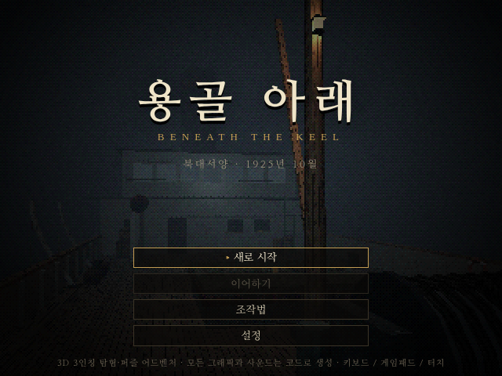 | 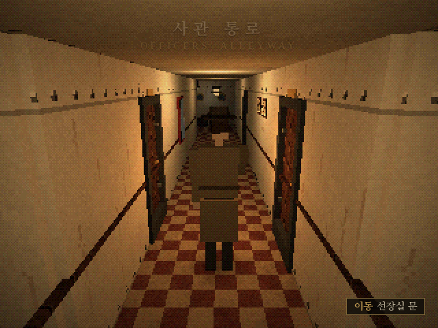 | 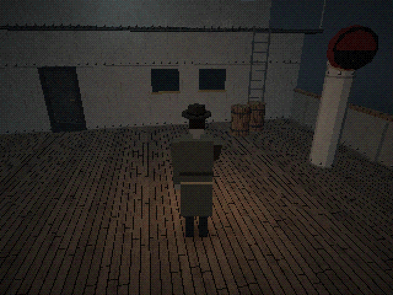 |
| 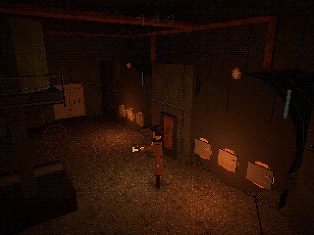 | 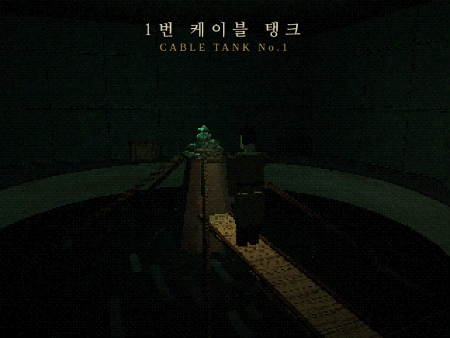 | 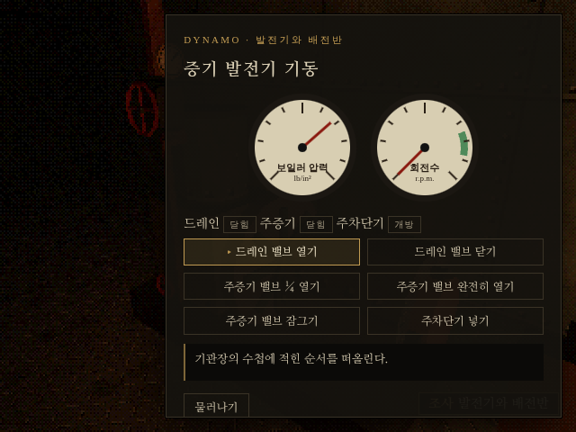 |
| 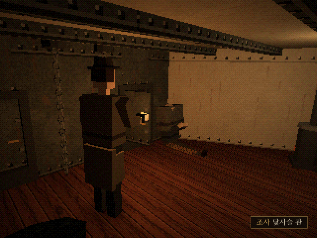 | 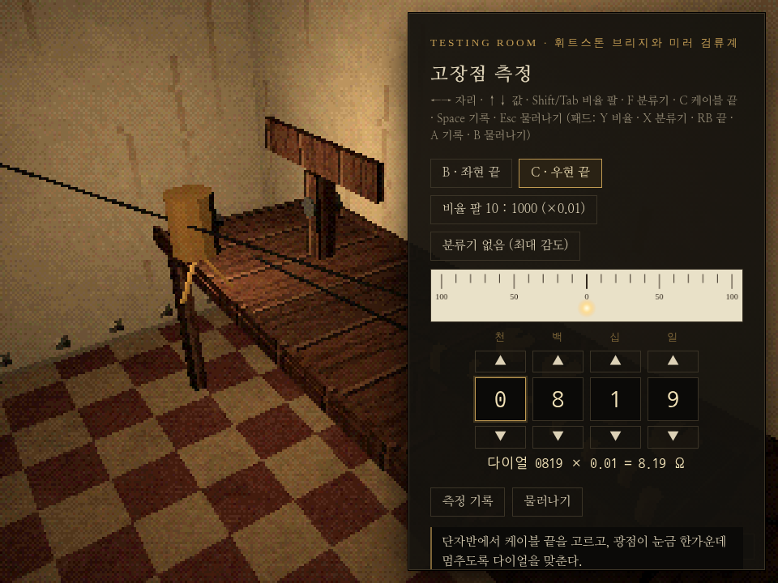 | 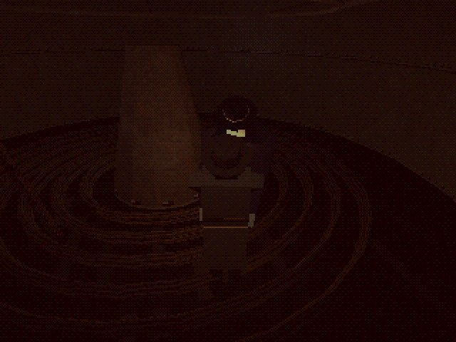 |
| 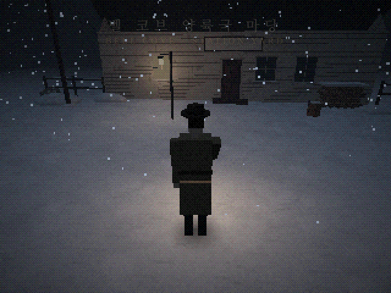 | 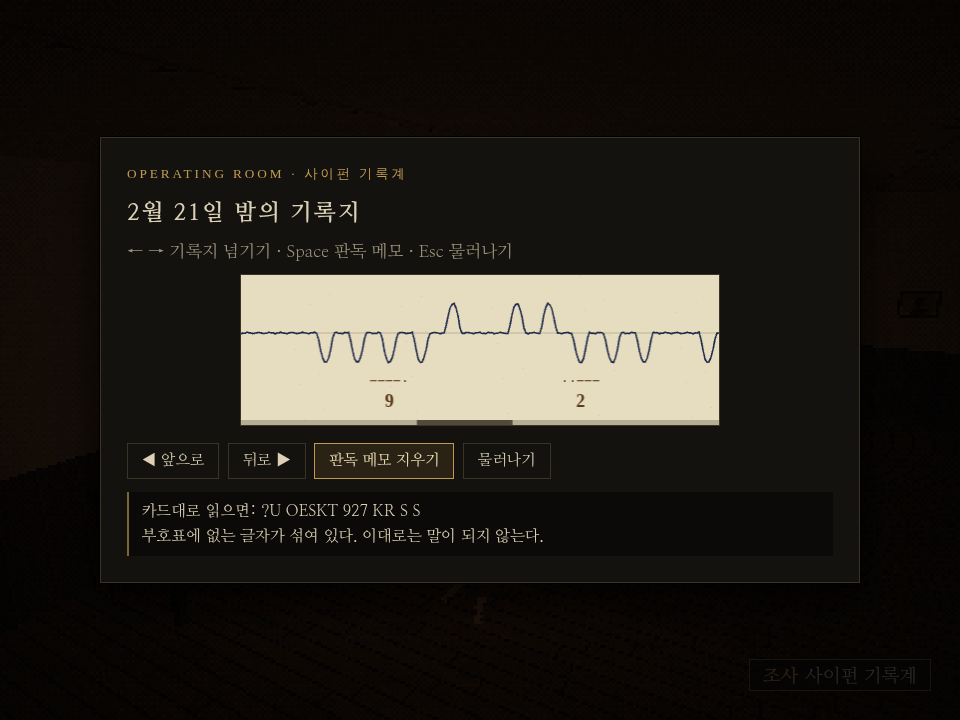 | 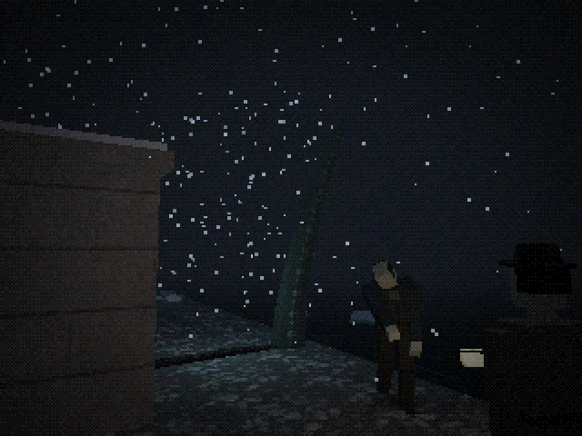 |
| 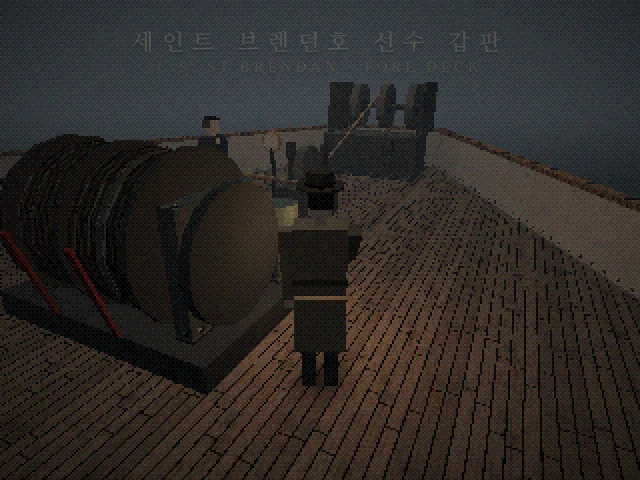 | 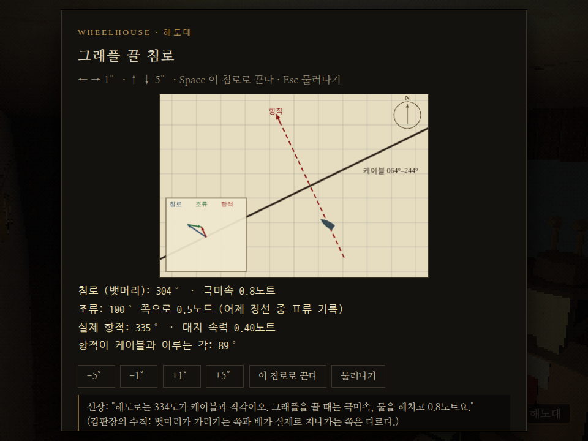 | 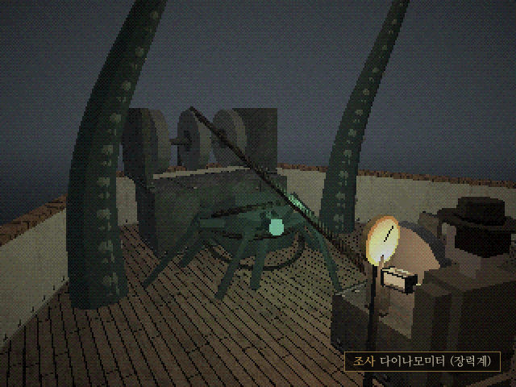 |
| 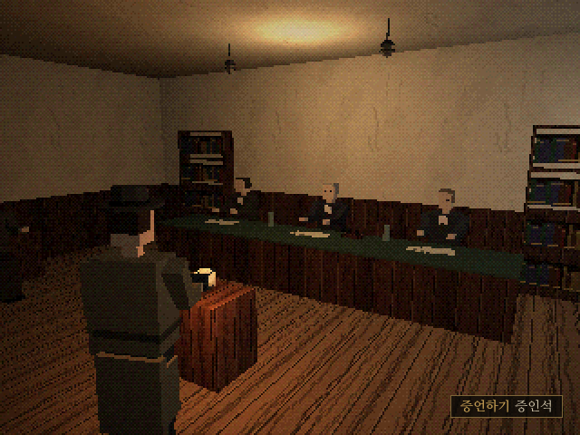 | 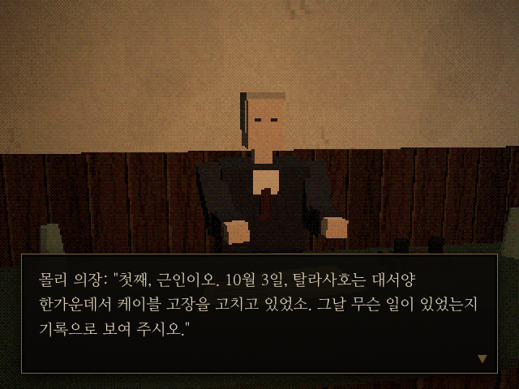 | 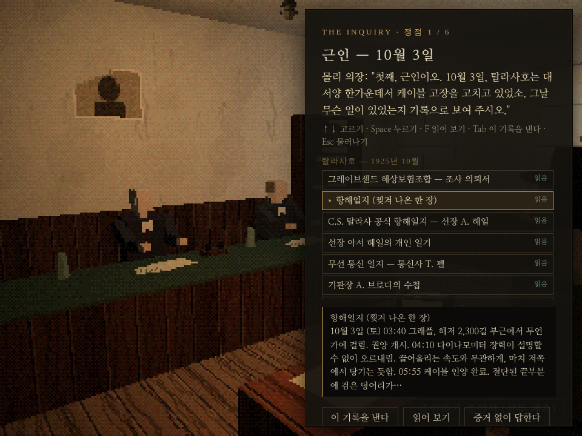 |

첫 줄 가운데·오른쪽은 기본인 **플레이어 추적 카메라** 화면입니다. 둘째 줄 왼쪽·가운데는 설정에서 고를 수 있는 **원작식 고정 카메라** 화면입니다. 셋째 줄은 **2막**, 넷째 줄은 **3막**, 다섯째 줄은 **4막**, 여섯째 줄은 **에필로그** 장면입니다.

## 실행

```bash
npm install
npm run dev        # http://localhost:5173 에서 플레이
npm run build      # dist/ 에 정적 파일 생성 (어느 정적 호스팅에나 올리면 됨)
```

Node.js 22 이상을 권장합니다. `dist/`는 상대 경로로 빌드되므로 GitHub Pages나 사내 웹서버의 하위 폴더에 그대로 올려도 동작합니다.

**GitHub Pages 배포:** 기본 브랜치에 push할 때마다 "Deploy to GitHub Pages" 워크플로가 타입 검사와 단위 테스트를 거쳐 빌드한 뒤 `https://<계정>.github.io/<저장소>/`에 올립니다. 처음 한 번은 저장소 Settings → Pages → Build and deployment → Source를 **GitHub Actions**로 바꿔야 합니다(그 전에는 배포 단계를 건너뜁니다). 바꾼 뒤에는 Actions 탭에서 이 워크플로를 한 번 실행(Run workflow)하거나 새로 push하면 됩니다.

## 조작

기본은 **화면 기준 조작**입니다. 누른 방향(화면에서 보이는 방향)으로 캐릭터가 돌아서 걷고, 카메라는 캐릭터 뒤를 느슨하게 따라갑니다. 벽이나 출입구 밖으로는 나가지 않고, 좁은 곳에서는 옆이나 위로 비켜 섭니다.

| 동작 | 키보드 | 게임패드 | 터치 |
|---|---|---|---|
| 이동 (누른 방향으로) | 방향키 / WASD | 왼쪽 스틱·십자키 | 왼쪽 스틱 (조금 밀면 천천히) |
| 달리기 | Shift 누르고 있기 | B 누르고 있기 | 스틱을 끝까지, 또는 달리기 버튼 |
| 카메라를 등 뒤로 | C / Q | RB | 시점 |
| 조사·열기·줍기·밀기 | Space / E / Enter | A | 조사 |
| 공격 (든 무기, 없으면 발차기. 가까운 적을 자동 조준) | F / J / Ctrl | X | 공격 |
| 소지품·상태 | I / Tab | Y | 소지품 |
| 일시정지·저장·설정 | Esc / P | Start | 메뉴 |

**원작처럼 하려면** 일시정지 → 설정에서 `조작 방식`을 **탱크 조작 (1992 원작)**, `카메라`를 **고정 카메라 (원작)** 로 바꾸면 됩니다. 탱크 조작은 캐릭터 기준이라 ↑/↓가 바라보는 방향으로 전진·후진, ←/→가 제자리 회전이며, ↑를 빠르게 두 번 누르면 달리고 ↓ + Shift로 뒤로 돕니다. 두 설정은 따로 고를 수 있습니다. 화면 기준 조작에서 방향키를 누르고 있는 동안에는 카메라가 돌거나 컷이 바뀌어도 진행 방향이 유지됩니다(Resident Evil HD 리마스터의 대체 조작과 같은 방식). 아날로그 스틱은 추적 카메라에서 지금 화면 기준으로 바로 반응합니다.

아이템은 쓸 대상 앞에 서서 소지품에서 **사용**을 고르면 됩니다(열쇠류는 가지고 있으면 문 앞에서 자동으로 씁니다). 문을 지날 때마다 자동 저장됩니다.

설정에서 조작 방식, 카메라, 해상도(320×240 "1992" / 480×360 / 640×480), 디더링, 색 단계(EGA·VGA 느낌), 음량, 조사 힌트 표시(끄면 원작처럼 힌트 없음), 글자 속도, 터치 조작 표시를 바꿀 수 있습니다.

<details>
<summary><b>공략 (스포일러)</b></summary>

1. 갑판: 권양기 옆 **쇠지렛대**를 줍고, 선실 문이 막혀 있으니 오른쪽 **사다리**로 선교에 오릅니다.
2. 선교: **해도대**에서 선장실 열쇠, 외투에서 브랜디, 바닥의 찢어진 항해일지를 챙기고 **계단**으로 내려갑니다.
3. 사관 통로: 원하면 옷장을 밀어 갑판 지름길을 엽니다. **선장실**에서 일기를 읽고, 복도의 **사진 두 장**을 확인합니다.
4. 기관실: 작업대의 **기관장 수첩**을 읽고 발전기를 수첩 순서대로 기동합니다.
   드레인 열기 → 주증기 ¼ 열기 → (마른 증기 확인) → 완전히 열기 → 드레인 닫기 → 회전계 초록 칸 → 주차단기.
5. 전기가 들어오면 통로에 무언가 나타납니다. 소화 설비함 유리를 깨 **소방 도끼**를 챙기면 싸우기 쉽습니다.
6. 금고 번호는 배가 물에 닿은 날(진수)이 아니라 **용골을 놓은 날**입니다: `11 · 03 · 14`.
7. 무선실: 의뢰서의 **500 kc**를 명판 공식으로 바꾸면 **600 m**입니다. 모스로 `··· −−− ···`(SOS)를 칩니다.
8. 금고에서 얻은 핸들로 기관실 **수밀문**을 열고, 케이블 탱크의 판자를 건너 **검은 돌**을 떼어냅니다.
9. 추격을 피해 기관실 **보일러 화실**에 돌을 던져 넣습니다. 불 앞에는 적이 다가오지 못합니다. 그러면 **2막**이 시작됩니다.

**2막 — 선수창 아래**

10. 갑판의 뜯긴 **승강구**로 선원 거주구에 내려갑니다. 좌·우현 체인 로커 문 두 곳에서 똑같이 두드리는 소리가 납니다.
11. 두 문에 SOS(또는 R)를 두드려 봅니다. **그대로 따라 치는 쪽은 흉내쟁이**이고, `R`·`K`로 **대답하는 쪽이 통신사 펠**입니다(어느 쪽인지는 매번 바뀜). 펠 쪽 문을 열면 시험실 열쇠를 줍니다.
12. 사관 통로의 **시험실**에서 시험대의 휘트스톤 브리지로 B(좌현)·C(우현) 두 케이블 끝을 잽니다. 목표는 **그것이 어느 쪽 케이블에 붙어 있는지** 알아내는 것입니다. 정답은 두 가지뿐입니다.

    | 끝 | 비율 팔 | 분류기 | 다이얼 |
    |---|---|---|---|
    | 성한 끝(육지국까지 1,037해리) | 1000 : 1000 (×1) | 없음 | **4044** |
    | 끊긴 끝(2.1해리, 그것이 붙은 쪽) | 10 : 1000 (×0.01) | 없음 | **0819** |

    - 어느 쪽(B/C)이 끊긴 끝인지는 판마다 다릅니다. B에서 4044를 맞춰 보고 광점이 가운데에 오면 B가 성한 끝, 오른쪽 끝에 붙으면 B가 끊긴 끝입니다(0819로 다시 맞춤).
    - 맞췄으면 **측정 기록**을 누릅니다. 두 끝을 다 기록하면 "끊긴 것은 ○ 끝이다"라고 나옵니다. 그 쪽이 15번에서 풀어 줄 드럼입니다.
    - 광점 읽는 법: **왼쪽**이면 다이얼 값이 모자란 것이니 올리고, **오른쪽**이면 내립니다. 분류기를 끼우면 둔해지니, 처음엔 1/999로 대강 맞추고 마지막엔 반드시 **분류기 없음**으로 기록합니다.
    - 조작: ←→ 자리, ↑↓ 값, Shift/Tab 비율 팔, F 분류기, C 케이블 끝 바꾸기, Space 측정 기록.
13. 기관실 **밸브 상자**에서 2번 탱크의 물을 뺍니다. ① 해수 흡입을 **닫고**, ⑤ 선외 배출을 열고, 잡용 펌프를 돌립니다(③ 2번 탱크 흡입은 열린 그대로).
14. 1번 탱크의 수밀문으로 **2번 탱크**에 내려가면 익사한 선장이 일어섭니다. 쓰러뜨리고 원뿔 사다리의 꾸러미에서 **고정핀 열쇠**를 얻습니다.
15. 갑판 **권양기**에서 고정핀 자물쇠를 열고, 측정한 쪽 드럼의 **클러치를 뺀 다음** 브레이크를 풉니다. 순서를 거꾸로 하면 드럼이 기관째 끌려 돕니다.
16. 케이블이 바다로 사라지면, SOS를 보냈는지에 따라 새벽이 옵니다(안 보냈으면 무선실로). 처음 올라온 **줄사다리**로 내려가면 2막이 끝나고 3막으로 이어집니다. 선원 거주구의 **펠을 업고** 내려가면 3막에서 그가 기다리고 있고, 두고 내려가면 3막은 혼자입니다.

**3막 — 뭍으로** (1926년 2월, 뉴펀들랜드)

17. 역 마당 모탕의 **장작 도끼**를 뽑습니다. 역사로 들어가 통신실 책상의 **소장 일지**, 기록계 탁자의 **판독 요령 카드**, 난로 선반의 **양초**와 럼을 챙깁니다.
18. 사환 앞의 **사이펀 기록계**에서 2월 21일 밤의 기록지를 봅니다. 카드대로 읽으면(판독 메모) "?U OESKT 927 KR"처럼 읽히지 않는 글자가 섞입니다. 소장의 전문이 **극성이 뒤집힌 메아리**로 돌아온 것입니다. 점과 선을 모두 바꿔 읽으면 "CG STORE ○○○ RK"입니다. 숫자는 자리마다 5를 더해 일의 자리만 남기면 됩니다(927 → 472, 번호는 매번 바뀜).
19. 축전지실 문: 펠이 `K`(−·−)로 물으면 **`R`(·−·)로 답합니다**. 따라 치면 열어 주지 않습니다. 혼자라면 무엇을 쳐도 그대로 돌아옵니다. 문을 열면 싸워야 합니다.
20. 축전지실 **창고**에 숫자를 넣어 ⑤번 스위치 손잡이를 얻습니다. **비중계**로 축전지 16개를 모두 재고, **1.250 이상인 12개**만 직렬로 묶습니다.
21. **회선 전환반**: ② 신호 축전기를 빼고(우회) ④ 시험을 물린 뒤 **브리지**로 잽니다. 정답은 비율 **10 : 1000 (×0.01)**, 분류기 없음, 다이얼 **0133**(1.33 Ω, 0.341해리)입니다. 고장점은 오두막 너머 바다 쪽으로 약 450 m, 해안 구간에 있습니다. 축전기를 넣은 채면 단선으로 읽힙니다.
22. 다시 전환반: ① 송수신, ③ 피뢰기, ④ 시험을 모두 떼고 **⑤ 고압만** 물립니다.
23. 펠과 함께라면 펠에게 말을 걸어 코일을 맡깁니다(틀린 곳이 있으면 짚어 줍니다). 해변의 **케이블 오두막**에서 육선 키로 `R`을 보내면, 메아리 `R`·펠의 `K`·메아리 `K`가 돌아옵니다. **`R`로 답하면** 펠이 쏩니다.
24. 혼자라면 코일에서 **양초 타이머**(약 70초)를 세우고 해변으로 달려가, 그것의 팔이 솟아 있는 동안 버팁니다(팔은 칼로 죽지 않고 사거리가 깁니다). 너무 늦거나 이르면 헛방이니 다시 세웁니다. 그것이 무너지면 3막이 끝나고 곧바로 4막이 시작됩니다.

**4막 — 갈고리** (1926년 4월, 수리선 세인트 브렌던호)

25. 갑판실 앞 **소화 설비함**에서 소방 도끼를 꺼냅니다. 장력계 옆의 **갑판장**에게 말을 걸어 그래플 수칙을 받습니다.
26. 사다리로 선교에 올라 **해도대**에서 침로를 잡습니다. 해도상 직각인 334°로 몰면 조류(100° 쪽 0.5노트) 때문에 실제 항적이 케이블을 비스듬히 지나가 그래플이 미끄러집니다. 침로를 **301~307°**(예: 304°)로 잡으면 항적이 약 335°로 케이블과 직각이 되고, 대지 속력도 0.4노트로 느립니다.
27. 갑판의 **장력계**에서 끌기를 지켜봅니다. 바늘이 확 튀었다 떨어지는 것은 바위이니 흘려보냅니다. 3톤에서 꾸준히 올라 **4톤 반을 넘어 버틸 때** 기관 정지를 누릅니다(5톤을 넘겨 끌면 끊어집니다). 실패하면 바닥이 바뀐 채 다시 끕니다.
28. **권양기**로 감아올립니다. 너울 표시를 보고 뱃머리가 들리기 전에 늦추거나 멈추고, 내려앉을 때 감습니다. 6톤을 넘기면 바이트가 끊어져 다시 끌어야 합니다.
29. **선수 쉬브**에서 전기기사에게 바이트를 자르게 하고, 갑판실의 **시험실**로 갑니다(책상에 브랜디). 시험대에서 두 끝의 **저항**을 재고 **BC를 불러** 봅니다. 약 4,038 Ω(벨 코브까지 1,035해리)이고 `R TP`(펠) 또는 `R BC`로 답하는 끝이 성한 끝입니다. 다른 끝은 약 3.1 Ω이고 부른 것을 뒤집어 돌려보낸 뒤 `R`을 칩니다. 성한 끝을 부표에 답니다.
30. 갑판의 **권양기**로 고장 난 끝을 감아올리면 뿌리가 올라옵니다. 뱃전을 넘어오는 익사자들을 쓰러뜨린 뒤, 뿌리 앞으로 다가가 팔들이 몸을 젖히면 **한 걸음 물러섭니다**. 팔이 헛치고 거두는 동안 들어가 **소방 도끼로** 내리치기를 네 번 되풀이해 검은 심장을 도려냅니다.
31. 승강구로 **화실**에 내려가 보일러에 심장을 넣으면 최종 엔딩입니다. 펠을 업고 나왔는지에 따라 엔딩이 갈립니다. 엔딩 화면의 **에필로그 · 조사위원회로**를 누르면 에필로그가 이어집니다.

**에필로그 — 조사위원회** (1926년 6월, 런던)

32. 위원회실 가운데의 **증인석**에 섭니다. 질문마다 서류철에서 기록 하나를 골라 **이 기록을 낸다**를 누릅니다(F로 읽어 볼 수 있습니다).
    - 틀리면 변호사가 반박하고 의장이 힌트를 줍니다. 두 번 틀리거나 증거 없이 답하면 그 쟁점은 "입증되지 않음"으로 남고 넘어갑니다.
    - 서류철을 닫으면 심문을 잠시 멈출 수 있고, 증인석으로 돌아가면 그 쟁점부터 다시 합니다.
33. 쟁점과 인정되는 기록:
    - ① 근인(10월 3일) — **찢겨 나온 항해일지**
    - ② 선원들 — **공식 항해일지** 또는 갑판장의 수첩
    - ③ 2번 탱크 — **선장의 마지막 편지**
    - ④ 케이블은 누구의 지시였나 — 다시 **선장의 마지막 편지**
    - ⑤ 그 밤의 위험 — **갑판장의 수첩** 또는 베일의 측정 기록
    - ⑥ 증언 — 탈라사호 바깥 사람의 기록: **벨 코브 소장 일지**, 회사 전보, 작업 지시서, 펠과 함께였다면 **펠의 진술서**
34. 마지막 질문("근인은 무엇이었소?")의 답이 판정의 부제가 됩니다. 여섯 쟁점을 모두 인정받으면 보험금이 전액 지급되고, 근인이 서지 않으면 지급이 보류됩니다.

</details>

## 구조

```
src/
  core/      입력(키보드·패드·터치 통합), 수학, 한국어 조사
  render/    저해상도 렌더러 + 디더링 후처리, 절차적 텍스처·재질
  world/     충돌(원·사각형·선분), 고정 카메라 선택, A* 격자, 방 빌더, 소품
  world/rooms/  19개 방 (갑판, 선교, 사관 통로, 선장실, 무선실, 기관실, 1번 케이블 탱크 / 2막: 선원 거주구, 시험실, 2번 케이블 탱크 / 3막: 역 마당, 통신실, 축전지·시험실, 케이블 오두막 / 4막: 수리선의 선수 갑판, 선교, 시험실, 화실 / 에필로그: 런던의 보험조합 위원회실)
  entities/  플레이어·적 관절 리그와 절차적 애니메이션, AI
  game/      게임 루프·스크립트 API, 막 구조와 막별 시작 상태, 퍼즐 로직(순수 함수), 세이브, 문서·아이템
  ui/        메시지·선택지, 소지품(3D 미리보기), 문서, 퍼즐 패널, 타이틀·메뉴, 터치
  audio/     Web Audio 합성 효과음·환경음
tests/       Vitest 단위 테스트
scripts/     헤드리스 브라우저 E2E·스크린샷 스크립트, 단일 HTML 빌드
docs/        디자인 문서, 로드맵, 플랫폼 검토, 스크린샷
```

게임 디자인, 퍼즐 흐름, 역사 고증과 출처는 **[docs/DESIGN.md](docs/DESIGN.md)**, 전체 계획은 **[docs/ROADMAP.md](docs/ROADMAP.md)** 에 있습니다.

## 테스트

```bash
npm test             # 단위 테스트 81개 (충돌, 카메라, A*, 화면 기준 조작, 추적 카메라, 1막 퍼즐, 2막의 노크·브리지·밸브·권양기, 3막의 기록지·메아리·자물쇠·축전지·전환반·코일·오두막 신호, 4막의 항적·장력계·너울·두 끝, 에필로그의 서류철·쟁점·판정, 세이브 등)
npm run typecheck
npm run e2e          # 헤드리스 Chromium으로 타이틀부터 1·2막, 막간, 3·4막과 최종 엔딩을 거쳐 에필로그의 판정까지 자동 플레이 (기본 조작, 펠과 함께)
E2E_SCHEME=tank node scripts/playthrough.mjs   # 같은 플레이를 원작 탱크 조작 + 고정 카메라로
E2E_FROM=act2 node scripts/playthrough.mjs     # 1막 결과를 설정해 두고 2막부터
E2E_FROM=act3 node scripts/playthrough.mjs     # 3막 시작 상태에서 혼자 (E2E_PELL=1이면 펠과 함께), 4막을 거쳐 엔딩까지
E2E_FROM=act4 node scripts/playthrough.mjs     # 4막 시작 상태에서 혼자 (E2E_PELL=1이면 펠이 벨 코브에 있는 판), 에필로그까지
E2E_FROM=epilogue node scripts/playthrough.mjs # 에필로그 시작 상태에서 혼자 (E2E_PELL=1이면 펠의 진술서로) 판정까지
node scripts/scenarios.mjs   # 곁가지 검사: 워터해머 매복, 사망→재시작, 저장→이어하기, 휴대폰 터치, 카메라 사각지대, 추적 카메라 이탈, 2·3·4막과 에필로그의 오답 경로, 막 선택 등 (SCEN=11처럼 구역만 실행 가능)
node scripts/fuzz.mjs        # 모든 방에서 (조작·카메라 조합을 바꿔 가며) 무작위 입력을 퍼부어 예외·멈춤 여부 확인
node scripts/render-sfx.mjs drip   # 효과음 하나를 게임의 합성 코드로 WAV로 렌더링하고 레벨·음높이를 측정 (.shots/audio/)
```

E2E 스크립트는 `playwright-core`로 Chromium을 띄웁니다. 기본 경로는 `/opt/pw-browsers/chromium`이며, 다른 경로는 `CHROMIUM_PATH` 환경변수로 지정합니다.

`npm run build:artifact`는 게임 전체를 HTML 파일 하나(`artifact/beneath-the-keel.html`, 약 950 KB)로 묶습니다.

## 참고

- 등장하는 배·회사·인물은 모두 가상입니다. 《Alone in the Dark》의 명칭이나 에셋은 쓰지 않았고 게임 문법만 참고했습니다.
- 사용 라이브러리: [three.js](https://threejs.org) (MIT). 글꼴은 Google Fonts(나눔명조, 나눔펜, 나눔고딕코딩, IM Fell English)를 불러오며, 불러오지 못하면 시스템 글꼴을 씁니다.
- 이 저장소의 라이선스는 아직 정하지 않았습니다.
