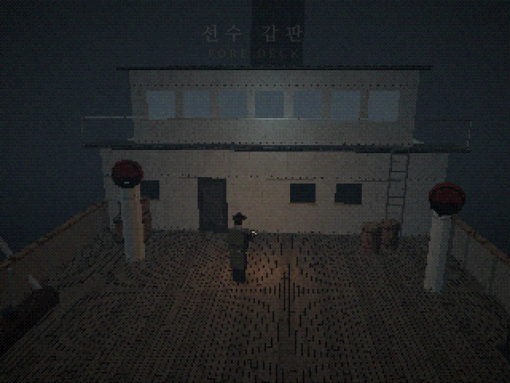
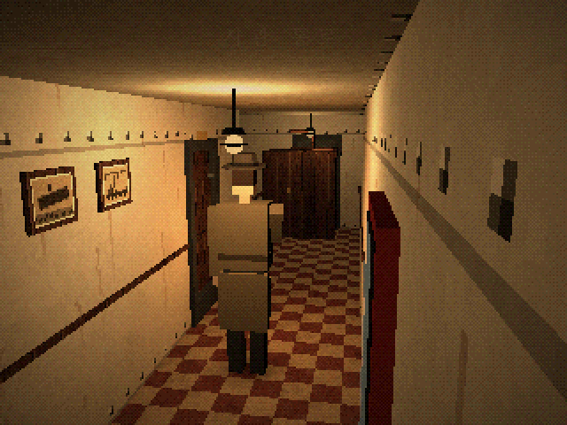

# 용골 아래 — Beneath the Keel

**1925년 10월, 북대서양.** 교신이 끊긴 채 표류하던 해저케이블 수리선 탈라사호에 보험 조사관이 홀로 오릅니다.
《Alone in the Dark》(1992)처럼 **고정 카메라 3D 3인칭 시점**으로 미지의 배를 탐험하고, 문서 속 단서로 퍼즐을 풀고, 어둠 속의 무언가를 피해 살아남는 웹 게임입니다.

- 브라우저에서 바로 실행됩니다(설치 불필요). 키보드, 게임패드, 휴대폰 터치를 모두 지원합니다.
- 그래픽·텍스처·사운드는 **전부 코드로 생성**합니다. 이미지나 오디오 파일은 하나도 없습니다.
- three.js + TypeScript + Vite. 게임 코드는 TypeScript 약 9,400줄 + CSS 800줄, 배포 번들은 JS 약 210 KB(gzip)입니다.

| | | |
|---|---|---|
|  |  |  |
|  |  |  |

## 실행

```bash
npm install
npm run dev        # http://localhost:5173 에서 플레이
npm run build      # dist/ 에 정적 파일 생성 (어느 정적 호스팅에나 올리면 됨)
```

Node.js 22 이상을 권장합니다. `dist/`는 상대 경로로 빌드되므로 GitHub Pages나 사내 웹서버의 하위 폴더에 그대로 올려도 동작합니다.

**GitHub Pages 배포:** 저장소 Settings → Pages → Source를 "GitHub Actions"로 바꾼 뒤, Actions 탭에서 "Deploy to GitHub Pages" 워크플로를 수동 실행하면 됩니다.

## 조작

| 동작 | 키보드 | 게임패드 | 터치 |
|---|---|---|---|
| 전진 / 후진 | ↑ / ↓ (W / S) | 스틱·십자키 | 왼쪽 스틱 |
| 제자리 회전 | ← / → (A / D) | 스틱·십자키 | 왼쪽 스틱 |
| 달리기 | Shift, 또는 ↑ 빠르게 두 번 | B 누르고 있기 | 달리기 버튼, 또는 스틱을 끝까지 |
| 뒤로 돌기 | ↓ + Shift | — | — |
| 조사·열기·줍기·밀기 | Space / E / Enter | A | 조사 |
| 공격 (든 무기, 없으면 발차기) | F / J / Ctrl | X | 공격 |
| 소지품·상태 | I / Tab | Y | 소지품 |
| 일시정지·저장·설정 | Esc / P | Start | 메뉴 |

원작처럼 **캐릭터 기준 조작(탱크 컨트롤)** 입니다. 카메라가 바뀌어도 ↑는 항상 캐릭터가 바라보는 방향입니다.
아이템은 쓸 대상 앞에 서서 소지품에서 **사용**을 고르면 됩니다(열쇠류는 가지고 있으면 문 앞에서 자동으로 씁니다). 문을 지날 때마다 자동 저장됩니다.

설정에서 해상도(320×240 "1992" / 480×360 / 640×480), 디더링, 색 단계(EGA·VGA 느낌), 음량, 조사 힌트 표시(끄면 원작처럼 힌트 없음), 글자 속도, 터치 조작 표시를 바꿀 수 있습니다.

<details>
<summary><b>공략 (스포일러)</b></summary>

1. 갑판: 권양기 옆 **쇠지렛대**를 줍고, 선실 문이 막혀 있으니 오른쪽 **사다리**로 선교에 오릅니다.
2. 선교: **해도대**에서 선장실 열쇠, 외투에서 브랜디, 바닥의 찢어진 항해일지를 챙기고 **계단**으로 내려갑니다.
3. 사관 통로: 원하면 옷장을 밀어 갑판 지름길을 엽니다. **선장실**에서 일기를 읽고, 복도의 **사진 두 장**을 확인합니다.
4. 기관실: 작업대의 **기관장 수첩**을 읽고 발전기를 수첩 순서대로 기동합니다.
   드레인 열기 → 주증기 ¼ 열기 → (마른 증기 확인) → 완전히 열기 → 드레인 닫기 → 회전계 초록 칸 → 주차단기.
5. 전기가 들어오면 통로에 무언가 나타납니다. 소화 설비함 유리를 깨 **소방 도끼**를 챙기면 싸우기 쉽습니다.
6. 금고 번호는 배가 물에 닿은 날(진수)이 아니라 **용골을 놓은 날**입니다: `11 · 03 · 14`.
7. 무선실: 의뢰서의 **500 kc**를 명판 공식으로 바꾸면 **600 m**입니다. 모스로 `··· −−− ···`(SOS)를 칩니다.
8. 금고에서 얻은 핸들로 기관실 **수밀문**을 열고, 케이블 탱크의 판자를 건너 **검은 돌**을 떼어냅니다.
9. 추격을 피해 기관실 **보일러 화실**에 돌을 던져 넣으면 엔딩입니다. 불 앞에는 적이 다가오지 못합니다.

</details>

## 웹 vs Unity 검토 요약

**결론: 목표에 따라 다릅니다.** 콘셉트 검증과 링크 공유가 목적인 지금 단계에서는 웹(three.js)이 맞고, 상용 출시(스팀·콘솔, 대량 아트 에셋, 팀 협업)로 가면 Unity가 유리합니다. 가중 다기준 평가로는 프로토타입 시나리오에서 웹 3.95 대 Unity 3.83, 상용 출시 시나리오에서 웹 3.35 대 Unity 4.38이 나옵니다. 근거, 출처, 이식 경로는 **[docs/ENGINE_REVIEW.md](docs/ENGINE_REVIEW.md)** 에 정리했습니다.

## 구조

```
src/
  core/      입력(키보드·패드·터치 통합), 수학, 한국어 조사
  render/    저해상도 렌더러 + 디더링 후처리, 절차적 텍스처·재질
  world/     충돌(원·사각형·선분), 고정 카메라 선택, A* 격자, 방 빌더, 소품
  world/rooms/  7개 방 (갑판, 선교, 사관 통로, 선장실, 무선실, 기관실, 케이블 탱크)
  entities/  플레이어·적 관절 리그와 절차적 애니메이션, AI
  game/      게임 루프·스크립트 API, 퍼즐 로직(순수 함수), 세이브, 문서·아이템
  ui/        메시지·선택지, 소지품(3D 미리보기), 문서, 퍼즐 패널, 타이틀·메뉴, 터치
  audio/     Web Audio 합성 효과음·환경음
tests/       Vitest 단위 테스트
scripts/     헤드리스 브라우저 E2E·스크린샷 스크립트, 단일 HTML 빌드
docs/        디자인 문서, 플랫폼 검토, 스크린샷
```

게임 디자인, 퍼즐 흐름, 역사 고증과 출처는 **[docs/DESIGN.md](docs/DESIGN.md)** 에 있습니다.

## 테스트

```bash
npm test             # 단위 테스트 25개 (충돌, 카메라, A*, 발전기·무선·금고 퍼즐, 세이브 등)
npm run typecheck
npm run e2e          # 헤드리스 Chromium으로 타이틀부터 엔딩까지 자동 플레이
node scripts/scenarios.mjs   # 워터해머 매복, 사망→재시작, 저장→이어하기, 휴대폰 터치 조작
```

E2E 스크립트는 `playwright-core`로 Chromium을 띄웁니다. 기본 경로는 `/opt/pw-browsers/chromium`이며, 다른 경로는 `CHROMIUM_PATH` 환경변수로 지정합니다.

`npm run build:artifact`는 게임 전체를 HTML 파일 하나(`artifact/beneath-the-keel.html`, 약 740 KB)로 묶습니다.

## 참고

- 등장하는 배·회사·인물은 모두 가상입니다. 《Alone in the Dark》의 명칭이나 에셋은 쓰지 않았고 게임 문법만 참고했습니다.
- 사용 라이브러리: [three.js](https://threejs.org) (MIT). 글꼴은 Google Fonts(나눔명조, 나눔펜, 나눔고딕코딩, IM Fell English)를 불러오며, 불러오지 못하면 시스템 글꼴을 씁니다.
- 이 저장소의 라이선스는 아직 정하지 않았습니다.
