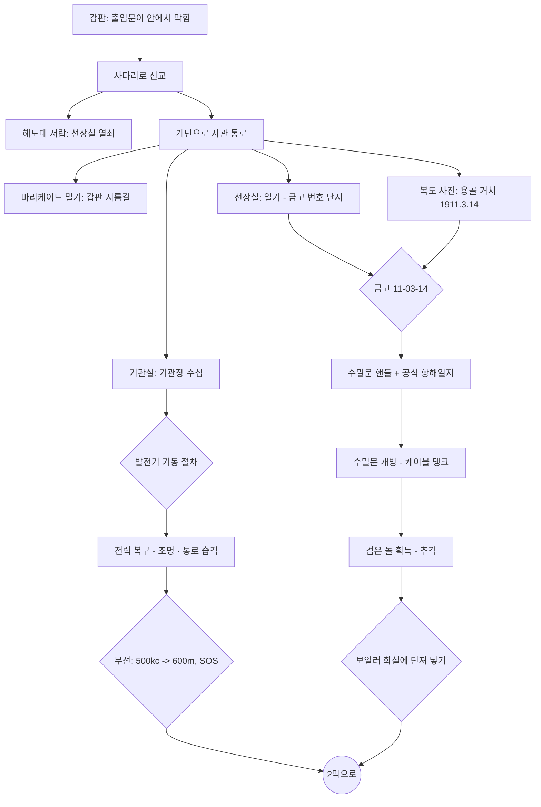
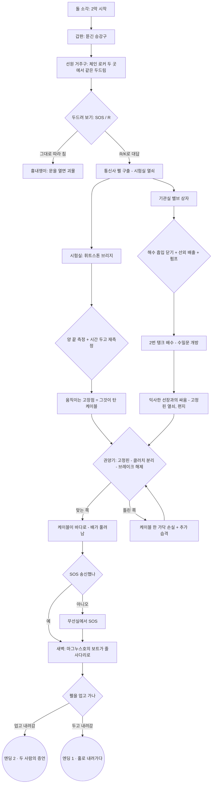

# 게임 디자인 문서 — 《용골 아래 (Beneath the Keel)》

> 1925년 10월, 북대서양. 교신이 끊긴 해저케이블 수리선에 홀로 오른 보험 조사관의 하룻밤.
> 3D 3인칭 탐험·퍼즐 어드벤처(2막, 방 10개, 엔딩 2종). Alone in the Dark(1992) 문법을 따르되 무대와 이야기는 모두 새로 만들었습니다.
> 기본은 플레이어 추적 카메라 + 화면 기준 조작이고, 원작의 고정 카메라 + 탱크 조작은 설정에서 고를 수 있습니다.

## 1. 원작 문법과 이 게임의 대응

| Alone in the Dark (1992)의 요소 | 이 게임에서의 구현 | 근거 |
|---|---|---|
| 평면 색 폴리곤 캐릭터 + 미리 그린 2D 배경 + 고정 카메라 | 무텍스처 플랫 셰이딩 캐릭터 + 텍스처 배경(실시간 3D). 카메라는 기본이 **플레이어 추적**이고, 설정에서 방마다 2~5개의 **고정 카메라** 존으로 바꿀 수 있음 | [H1], [H6] |
| 캐릭터 기준 조작(위: 전진, 좌우: 회전, 아래: 후진, 위 두 번: 달리기) | 기본은 **화면 기준 조작**(누른 방향으로 돌아서 걷기). 원작의 캐릭터 기준(탱크) 조작은 설정에서 선택, Shift 달리기와 "↓+Shift 뒤로 돌기" 추가 | [H3], [H5] |
| 행동 선택(열기/찾기, 싸우기, 밀기 등) 후 Space | 상황 기반 단일 행동 키(조사·열기·줍기·밀기) + 별도 공격 키 | [H3] |
| 1920년대, 러브크래프트풍 공포 | 1925년, 심해에서 끌어올린 "검은 돌"과 익사한 선원들 | [H1] |
| 책·일기로 전달되는 이야기와 단서 | 14종 문서(보험 의뢰서, 항해일지, 선장 일기, 기관장 수첩, 무선 일지, 갑판장 수첩, 고장점 측정 요령, 배수 계통도, 선장의 마지막 편지 등) | — |
| 가구를 밀어 길을 막거나 여는 퍼즐 | 선원들이 쌓은 바리케이드(옷장)를 밀어 갑판 출입문 개방 | — |

**조작과 카메라를 바꾼 이유.** 탱크 조작은 고정 카메라 컷이 바뀌어도 "↑ = 캐릭터 앞"이 변하지 않게 하려는 장치였지만, 지금 플레이어에게는 가장 큰 진입 장벽입니다. 같은 장르의 후대 작품들도 같은 길을 갔습니다. Resident Evil HD 리마스터(2015)는 누른 방향으로 걷는 대체 조작을 넣으면서, 스틱을 누르고 있는 동안에는 컷이 바뀌어도 직전 카메라 기준의 방향을 유지하게 했고 [H5], 2024년 Alone in the Dark 리메이크는 고정 카메라를 버리고 어깨 너머 3인칭 카메라를 택했습니다 [H6]. 이 게임은 두 가지를 모두 따릅니다. 기본은 추적 카메라 + 화면 기준 조작이고, [H5]의 방향 유지(래치)는 방향키 입력(고정 카메라에서는 스틱도)에 적용하며, 원작 그대로의 탱크 조작도 남겨 두었습니다.

Guinness World Records는 이 게임을 "최초의 3D 서바이벌 호러 비디오게임"으로 등재했고 [H2], Resident Evil(1996)의 미카미 신지는 이 게임이 없었다면 RE가 1인칭 슈팅이 됐을 것이라고 말했습니다 [H4].

## 2. 무대와 고증

- **해저케이블 수리선(C.S., Cable Ship).** 케이블은 원형 탱크에 원뿔(cone)을 중심으로 사려 담았고, 거터퍼카 피복이 갈라지지 않도록 **탱크에 물을 채워** 두었습니다 [M1]. 선수에는 쉬브(sheave)와 권양기(picking-up gear, "cable engine")·장력계(dynamometer)가 있었습니다 [M2]. 수심 약 2,000길(fathom) 안팎에서 그래플로 케이블을 걸어 올리는 수리는 실제로 있었지만 느리고 불확실한 작업이었습니다 [M3]. 시험실에서는 미러 검류계로 저항(브리지) 시험을 해 고장 위치를 찾았습니다 [M2].
  - 참고로 영국 체신청 소속 케이블선은 1920년대에 "HMTS"를 썼고, "CS"는 민간 회사 선박에서 쓰였습니다 [M4]. 이 게임의 탈라사호는 가상의 민간 회사 소속입니다.
- **무선.** 600 m(500 kc) 파장은 1912년 런던 협약에서 선박 표준·조난 파장이 되었고, 1927년 워싱턴 규칙에서 "국제 호출·조난 파장"으로 명시됐습니다 [R1][R2]. SOS는 1906년 베를린 협약에서 채택되어 1908-07-01부터 시행됐습니다 [R3]. 선박 송신기는 배의 직류 발전기 전원을 썼고, 별도의 축전지 비상 송신 장치가 있었습니다 [R4].
- **조선 용어.** 용골 거치(keel laying)는 건조의 공식 시작, 진수(launching)는 선체를 물에 띄우는 일입니다 [S1]. 조선소 명판(builder's plate)에는 보통 조선소명·소재지·선체 번호(yard number)·건조 연도가 새겨지고 **배 이름은 드뭅니다** [S2]. 그래서 금고 번호의 단서인 날짜는 명판이 아니라 복도의 **용골 거치 기념 사진**에 넣었습니다.
- **증기 기관 절차.** 증기관은 드레인을 열고 정지 밸브를 살짝 열어 데운 뒤(warm through), 드레인에서 마른 증기가 나오면 밸브를 천천히 끝까지 열고 드레인을 닫습니다. 이를 어기면 워터해머가 생깁니다 [E1][E2]. 1920년대 상선은 3단 팽창 기관과 스카치 보일러가 표준이었고 [E3], 선내 전기는 증기기관이 돌리는 직류 발전기(대략 100~110 V)에서 나왔습니다 [E4].
- 등장하는 선박·회사·인물(탈라사호, 마그누스호, 던마로 조선소, 그레이브센드 보험조합, 헤일 선장, 통신사 펠, 전기기사 베일 등)은 모두 **가상**입니다.

### 2막의 고증

2막의 퍼즐은 케이블선의 실제 장비와 절차에서 가져왔습니다.

**조사 방법과 한계.** 자료 조사는 별도 에이전트가 했습니다. 네트워크 프록시가 atlantic-cable.com, Wikipedia, archive.org 같은 본문 페이지를 막아서 **대부분 검색 결과 요약(snippet)에 근거**합니다.
- 원칙은 사실 하나에 독립 출처 둘입니다. 출처가 하나뿐인 항목은 **[단일 출처]**로 표시했습니다.
- 이번 작업에서 핵심 수치를 다시 검색해 교차 확인했고, 결과는 아래에 함께 적었습니다.

- **권양기(picking-up gear).** 당시 명칭은 "picking-up gear / paying-out gear"이고, "cable engine"은 현대 용어입니다. 게임 UI도 PICKING-UP GEAR로 표기했습니다.
  - 케이블은 바다 → 선수 쉬브 → 장력계(dynamometer) 쉬브 밑 → 드럼(3~5바퀴 감아 마찰로 붙잡음) → 탱크 순서로 지나갑니다 [C1][C2].
  - 선수 쉬브는 셋이 흔했습니다(Faraday, 1923). 겹(double) 권양 장치를 갖춘 배도 있었습니다(Colonia, John W. Mackay) [C3].
  - 브레이크는 레버로 조이는 띠 브레이크("brake-strap")였습니다 [C2][단일 출처].
  - 케이블을 내보낼 때는 "권양기를 기어에서 빼고 브레이크로 제어"했습니다(CS Alert, 1890) [C4][단일 출처].
  - 게임의 해제 순서(**고정핀 → 클러치 분리 → 브레이크 해제**)는 이 절차를 따랐습니다. 고정핀과 자물쇠는 선장이 덧붙인 것으로 설정한 **창작**입니다. 클러치가 도그식인지 마찰식인지는 자료를 찾지 못했습니다.
- **케이블 탱크.**
  - 원형 수밀 탱크 가운데에 원뿔(cone)이 있었습니다. 거터퍼카가 마르면 갈라지므로 물을 "맨 윗 사리 몇 인치 아래까지" 채웠습니다 [M1][C5].
  - 사리 위에 매다는 강관 틀 "크리놀린(crinoline)"은 1896년 기록이 있고, 튀어 오르는 케이블 고리를 막는 장치입니다 [C5].
  - 사리가 엉켜 드럼을 멈춰 세운 사고("foul flake")도 기록돼 있습니다 [C6].
- **고장점 측정(시험실).** 핵심 수치는 아래 표에 모았습니다.
  - 완전 단선("total break", 당시 표현으로 "full ground")이면 **측정한 도체 저항 ÷ 해리당 도체 저항 = 고장점까지 거리**입니다 [T1].
  - 끊어진 구리 끝이 제 저항을 보태므로 계산값은 실제보다 멉니다. 게임 속 측정 요령 카드의 주의 문구가 이것입니다.

| 항목 | 값 | 근거·교차 확인 |
|---|---|---|
| 300 lb 심선의 해리당 저항 (24 °C) | 4.272 Ω | 1866년 대서양 케이블 기록 [T2][단일 출처]. 이번 재검색에서도 원문 확인에 실패해, 아래 물리 계산으로 검증함 |
| 같은 심선, 순수 연동(100 % IACS) 가정 | 3.86 Ω (20 °C) | 300 lb = 136 kg, 밀도 8.89 g/cm³ → 단면 8.27 mm², 비저항 1.724×10⁻⁸ Ω·m로 계산(**자체 계산**). 4.272 Ω는 도전율 약 92 % IACS(연선 꼬임 포함)에 해당해 1860년대 구리로 무리가 없음 |
| 구리 저항 온도계수 | +0.393 %/°C | [T3] |
| 해저 수온 약 3 °C에서 | **약 3.9 Ω/해리** (게임 값) | 4.272 Ω(24 °C)를 3 °C로 환산하면 3.93 Ω(**자체 계산**). 순수 연동 가정이면 3.61 Ω |

  - **우체국 상자(Post Office box) 브리지.** 비율 팔은 10·100·1000 Ω이고, 균형이면 X = R·Q/P입니다 [T4, 재검색으로 확인]. 다이얼(데케이드)식은 1903~07년 무렵 있었습니다 [T4].
  - **검류계 분류기.** 1/9·1/99·1/999 분류기는 감도를 1/10·1/100·1/1000로 낮춥니다 [T5, 재검색으로 확인]. 거친 균형은 분류기를 끼우고 잡고, 마지막 자리는 분류기를 빼고 맞춥니다.
  - **미러 검류계.** 톰슨의 선박용 미러 검류계가 있었고 [T6], 선박의 움직임이 검류계 측정을 방해한다는 1886년 기록이 있습니다 [T7][단일 출처]. 그래서 시험실은 사관 구역(선체 중앙)에 두었습니다.
  - **단순화.** 실제 절차는 같은 비율 팔로 R₀와 R₀+1(편향이 반대)을 찾은 뒤 비율을 바꿔 소수 자리를 읽습니다 [T4]. 게임은 "값이 넘치지 않는 가장 작은 비율 팔로 네 다이얼을 다 쓴다"로 줄였습니다.
- **빌지·밸러스트 밸브 상자.**
  - 1916년 선박 기관사 교범에 "Bilge Suction Valve Chest" 항목이 있습니다 [B1].
  - 1912년 타이타닉 조사 보고서에는 빌지·밸러스트 펌프와 교차 연결된 이중 본관이 나옵니다 [B2].
  - 빌지 흡입관에는 나사 내림식 역지 밸브(screw-down non-return valve)가 있습니다 [B1][B3].
  - 흡입관이 밸브 상자에 열린 채 해수 흡입까지 열려 있으면, 바닷물이 관을 거꾸로 타고 구획으로 들어갑니다 [B3]. 이 침수 기전은 현대 손해예방 자료에 나오지만 원리는 같습니다.
  - **게임상 가정.** 케이블 탱크의 물을 어떻게 넣고 뺐는지는 자료를 찾지 못했습니다. 그래서 밸러스트 계통(양방향이라 역지 밸브가 없음)으로 탱크를 채우고 비운다고 **가정**했습니다.
- **선수루와 체인 로커.**
  - 체인 로커는 선수루 아래, 충돌 격벽 앞에 있습니다. 닻사슬은 로커 → 스펄링 파이프 → 양묘기 → 호스 파이프로 이어집니다 [F1].
  - 선원은 선수루에서 살았고, 오래된 배에서는 닻사슬이 거주 공간을 지나가기도 했습니다 [F2].
- **모스 응답.** 1906년 규정에서 `K`(− · −)는 "송신하라(invitation to transmit)"였습니다. 1912년 규정(1914년 재인쇄)에서 `R`은 "수신함"이었습니다 [R5].
  - 펠이 SOS에 `R`, R에 `K`로 답하는 것은 이 관례를 따랐습니다. 메아리만 하는 괴물과 구별되도록 **절대 같은 신호를 돌려주지 않습니다**.
- **창작(사실 아님).**
  - 잘라 낸 케이블의 양 끝을 동시에 선수 쉬브에 걸어 두는 것. 실제로는 성한 끝을 봉해 부표에 매달고, 고장 난 끝만 끌어올렸습니다 [M1].
  - 시험실 단자반의 B·C 끝 표기.
  - 고장점이 시간에 따라 다가오는 것(시간당 약 0.54해리).

## 3. 공간 구성

```
                 [선교] ──계단── [사관 통로] ── 선장실
                   │               │    ├──── 무선실
                 사다리        (바리케이드) └── 시험실(2막, 펠의 열쇠)
                   │               │
 [선수 갑판] ──────┘    출입문 ────┘
     │ 승강구(2막)                 │ 사다리
 [선원 거주구]                  [기관실] ──수밀문── [1번 케이블 탱크]
  └ 체인 로커 ×2               (밸브 상자)            │ 수밀문(2막, 배수 후)
                                                [2번 케이블 탱크]
```

| 방 | 크기(m) | 카메라 | 핵심 요소 |
|---|---|---|---|
| 선수 갑판 | 12×25 | 5 | 선수 쉬브로 바다에 드리운 케이블, 봉인된 해치, 권양기, 빈 대빗 |
| 선교 | 10×5.2 | 2 | 타륜, 쌍발 기관 전령기, 해도대(열쇠), 외투(브랜디) |
| 사관 통로 | 17×5 | 4 | 바리케이드, 용골 거치·진수 사진, 소화 설비함(도끼) |
| 선장실 | 6×4.4 | 2 (+금고 근접) | 일기(단서), 금고 |
| 무선실 | 4.8×3.6 | 2 (+송신기 근접) | 불꽃 송신기, 모스 부호표, 무선 일지, 시험 기록 |
| 기관실 | 14×15.5 | 5 (+발전기·화실 근접) | 3단 팽창 기관, 스카치 보일러 2기, 발전기·배전반, 수밀문 |
| 1번 케이블 탱크 | 15×15 | 5 | 물이 찬 원형 탱크, 판자 다리, 원뿔 위의 검은 돌, 2번 탱크로 가는 수밀문 |
| 선원 거주구 (2막) | 8.8×10 | 2 | 이층 침상, 식탁, 난로, 좌·우현 체인 로커 문, 승강구 사다리 |
| 케이블 시험실 (2막) | 4×3.6 | 1 (+브리지 근접) | 휘트스톤 브리지, 미러 검류계, 전지, 단자반 |
| 2번 케이블 탱크 (2막) | 지름 10.4 | 2 | 물을 뺀 탱크 바닥, 원뿔과 사리, 크리놀린, 선장의 시신 |

## 4. 진행 흐름과 퍼즐 (스포일러)

### 4.1 1막 — 검은 돌



| # | 퍼즐 | 해법 | 설계 의도 |
|---|---|---|---|
| 1 | 막힌 출입문 | 사다리로 선교를 거쳐 안으로 들어간 뒤, 안쪽에서 바리케이드를 밀어 지름길을 연다 | 탐험 유도, 원작의 "밀기" 재해석 |
| 2 | 선장실 | 해도대 서랍의 열쇠(가지고 있으면 문 앞에서 자동 사용) | 튜토리얼 수준 |
| 3 | 소화 설비함 | 쇠지렛대로 깨거나 발차기 → 소방 도끼 | 무기 획득과 소리의 위험 |
| 4 | 금고 | 일기: "물에 처음 닿은 날이 아니라 첫 뼈대가 놓인 날, 해·달·날" → 복도 사진의 **용골 거치일** 1911-03-14 → `11-03-14`(진수일 `11-09-02`는 오답) | 조선 전문 지식이 있으면 즉시, 없어도 문서로 풀림 |
| 5 | 발전기 | 드레인 열기 → 주증기 ¼ 열기 → (마른 증기 확인) → 완전히 열기 → 드레인 닫기 → 회전계 초록 칸 → 주차단기 | 실제 증기관 운전 절차. 순서를 어기면 워터해머가 나고 그 소리가 선저의 적을 부름 |
| 6 | 무선 | 의뢰서의 500 kc와 명판의 `파장×주파수=300,000` → **600 m**, 모스 부호로 `SOS` | 단위 환산 + 모스 입력(짧게/길게 누르기) |
| 7 | 수밀문 | 금고에서 얻은 개폐 핸들 | 게이트 |
| 8 | 결말 | 검은 돌을 들고 추격을 피해 보일러 화실로(불 앞은 적이 들어오지 못하는 안전지대) | "불을 꺼뜨리지 마라"라는 복선 회수 |

1막은 검은 돌을 태우면 끝나지만, 이야기는 거기서 끝나지 않습니다. SOS는 1막에서 보내도 되고 2막 끝에 보내도 됩니다.

### 4.2 2막 — 선수창 아래

돌이 불 속에서 죽자, 선수에 걸린 케이블을 저 아래의 무언가가 끌어당기기 시작합니다. 화면이 아주 조금 선수 쪽으로 기울어(트림) 배가 끌려가고 있음을 보여 주고, 2막의 적들이 새로 나타납니다.



| # | 퍼즐 | 해법 | 설계 의도 |
|---|---|---|---|
| 9 | 두 개의 두드림 | 두 체인 로커 문에 SOS나 R을 두드려 본다. 그대로 따라 치는 쪽은 흉내쟁이이고, `R`/`K`로 **대답**하는 쪽이 펠이다. 갑판장 수첩: "진짜 사람은 두드림을 따라 하지 않는다. 대답을 한다." | 1막의 "세 번, 쉬고, 세 번"을 뒤집는 반전. 어느 쪽인지는 매 판 무작위 |
| 10 | 고장점 측정 | B(좌현)·C(우현) 끝을 각각 브리지로 잰다. 한쪽은 육지국까지 1,037해리(4,044 Ω, ×1 비율), 다른 쪽은 2해리 남짓의 완전 단선(×0.01 비율). 시간을 두고 다시 재면 단선 지점이 **배 쪽으로 다가온다** | 실제 계측 절차(비율 팔·분류기·영점 균형)를 그대로 손으로 해 보는 퍼즐. 측정 전에는 브레이크를 풀지 않는다 |
| 11 | 2번 탱크 배수 | 처음 상태는 ①해수 흡입과 ③2번 탱크 흡입이 열린 채 펌프 정지(바닷물 역류). ①을 닫고 ⑤선외 배출을 열고 펌프 기동. 배출을 안 열면 헛압(dead head), 해수를 연 채면 바다를 퍼 올릴 뿐 | 배관 계통도 한 장으로 푸는 기관실 실무 퍼즐 |
| 12 | 선장 | 탱크 바닥의 헤일 선장이 일어선다(체력 6, 한 대에 2. 팔을 치켜들 때 물러났다가 회복하는 틈에 친다). 원뿔 사다리에 묶인 꾸러미에 고정핀 열쇠와 마지막 편지 | 보스전 |
| 13 | 케이블 놓아 보내기 | 고정핀 자물쇠 → 해당 드럼 클러치 분리 → 브레이크 해제. 클러치를 문 채 브레이크를 풀면 기관째 끌려 돈다. 틀린 쪽을 풀면 케이블 한 가닥을 잃고 습격이 늘어난다 | 1890년 기록의 "기어에서 빼고 브레이크로 제어" [C4] |

**엔딩.** 케이블을 놓고 SOS를 보내면 새벽이 오고, 마그누스호의 보트가 처음 타고 올라온 줄사다리 아래로 옵니다.
- 펠은 구출할 때 "케이블을 놓거든, 데리러 와 주시오"라고 말합니다.
- 선원 거주구로 돌아가 그를 업고 줄사다리를 내려가면 **엔딩 2 「두 사람의 증언」**입니다.
- 그를 두고 내려가면(줄사다리에서 한 번 더 묻습니다) **엔딩 1 「홀로 내려가다」**입니다. 내려가기 직전 선수에서 "세 번, 쉬고, 세 번" 두드림이 들리고, 조사관은 돌아보지 않습니다.
- 펠을 구하지 않으면 시험실 열쇠가 없어 케이블을 놓을 수 없습니다. 그래서 두 엔딩은 펠을 구한 뒤의 선택으로 갈립니다.

**난이도 설계.**
- 고장점은 플레이 시간 기준으로 약 0.00015해리/초씩 다가옵니다(최저 0.3해리).
- ×0.01 비율에서 다이얼 한 칸(0.01 Ω)이 바뀌는 데 약 17초가 걸립니다. 그래서 균형을 잡을 시간은 넉넉하고, 1분 뒤에 다시 재면 두세 칸 줄어든 것이 보입니다.
- 균형 판정 허용치는 max(0.2 %, 다이얼 한 칸의 0.6배)입니다. 몇 시간을 플레이해도 항상 맞출 수 있는 값이 있습니다(단위 테스트로 6시간 구간 전체를 확인).

## 5. 시스템

- **추적 카메라(기본).** 캐릭터 뒤 1.9~3.3 m에 "느슨한 줄"처럼 매달려, 멀어지면 끌려오고 다가오면 물러나며, 걷는 동안 천천히 등 뒤로 돌아갑니다(정면으로 걸어올 때는 180° 휙 돌지 않음). 방의 **벽 선은 높이와 상관없이**(갑판 불워크, 선교 창턱 포함) 출입구까지 2D 광선으로 막고, 천장·보일러 같은 큰 물체는 3D 광선으로 피합니다. 막히면 주변 각도를 탐색해 트인 쪽으로 비켜 서는데, 걷는 동안에는 '등 뒤'를 기준으로 점수를 매기고 옆을 지나 앞쪽으로 도는 각도는 크게 감점합니다(문으로 막 들어와 등이 벽에 붙어 있어도 정면이 아니라 옆에서 비추고, 걸어 나가면 등 뒤로 돌아옴). 그래도 좁으면 위로 올라가 어깨 너머로 내려다봅니다. 정적 메시는 그리기용으로 재질별 병합하지만 광선은 병합 전 원본(보이지 않는 대리 메시)에 쏴서 비용을 줄였습니다(헤드리스 Chromium 실측 프레임당 0.06~0.45 ms, 병합 메시에 쏠 때는 0.5~2.5 ms). 구현은 `src/game/FollowCam.ts`입니다.
- **고정 카메라(원작).** 방마다 바닥 사각형 존과 카메라(위치·주시점·FOV·추적 비율)를 정의합니다. 현재 카메라의 존 안에 있는 동안에는 전환하지 않는 **히스테리시스**로 경계에서 화면이 떨리지 않게 했습니다(`src/world/cameras.ts`). 금고·발전기·무선기는 어느 모드에서든 근접 카메라로 컷합니다.
- **화면 기준 조작.** 카메라 시선의 수평 성분으로 화면 "위/오른쪽" 기저를 만들고 입력을 월드 방향으로 바꿉니다. 캐릭터는 그 방향으로 돌면서(초당 최대 9~11 rad) 각도 차가 작아질수록 빨라지고, 스틱을 조금 밀면 천천히 걷습니다. 방향키 입력은(고정 카메라에서는 스틱도) 입력이 바뀌거나 손을 뗄 때까지 기저를 유지합니다 [H5]. 추적 카메라는 걷는 동안 등 뒤로 돌아가므로 매 프레임 기저를 다시 읽으면 누르고 있는 →가 원을 그리기 때문입니다. 추적 카메라에서 아날로그 스틱은 매 프레임 화면 기준으로 갱신합니다. 공격하면 앞쪽 2.3 m 안의 가장 가까운 적을 자동으로 향합니다(`src/game/controls.ts`).
- **충돌.** 모든 캐릭터는 바닥 평면 위의 원입니다. 벽·가구는 사각형·원·선분이고, 빠른 이동에도 벽을 뚫지 않도록 5 cm 단위로 서브스텝합니다(`src/world/collision.ts`).
- **적 AI.** 25 cm 격자 A*와 시야 확인으로 가구를 돌아 추적합니다. 발소리가 한 걸음마다 빨라졌다 느려지고, 가까워지면 돌진합니다. 휘두르기 시작하면 맞아도 멈추지 않으며, 보일러 불빛 반경에는 들어오지 않습니다.
- **렌더링.** 320×240(설정에서 480·640 선택 가능) 오프스크린 렌더 → sRGB 변환 → 비네트·필름 그레인 → 4×4 베이어 디더링과 채널당 20단계 양자화 → 최근접 필터로 화면에 맞춰 확대(4:3 고정). 조명은 라이트 풀(포인트 6 + 반구 + 달빛)로 고정해 방을 오갈 때 셰이더를 다시 컴파일하지 않습니다. 정적 지오메트리는 재질별로 병합합니다. 실측 결과 프레임당 드로콜은 62(선교)~174(기관실)회, 삼각형은 1.9천~6.7천 개입니다(캐릭터·후처리 포함).
- **오디오.** 효과음과 환경음은 모두 Web Audio로 합성합니다(파도, 선체 삐걱임, 보일러 불길, 워터해머, 모스 신호음, 심장 박동 등). 강철 격실 느낌을 내려고 생성한 임펄스 응답으로 리버브를 겁니다.
- **저장.** 문을 지날 때마다 자동 기록하고, 일시정지 메뉴에서 수동 기록도 할 수 있습니다(localStorage). 죽으면 마지막 기록에서 다시 시작하며, 이때 체력은 최소 3으로 회복됩니다(죽음 반복 방지).
- **입력.** 키보드·게임패드·터치(가상 스틱과 버튼)를 같은 가상 버튼으로 통합하고, 화면 기준 조작용으로 터치·패드 스틱은 아날로그 값도 넘깁니다. 한 프레임보다 짧은 탭도 놓치지 않습니다.
- **2막 로직.** 퍼즐 판정은 DOM·three.js와 분리된 순수 함수로 두어 단위 테스트합니다(`src/game/logic2.ts`). 다루는 것은 노크 응답, 브리지 판정(분류기·비율 팔), 펌프 결과, 권양기 상태 기계입니다.
  - 퍼즐 상태는 모두 저장 플래그에 들어갑니다. 고장점의 시계는 페이지 시계가 아니라 **저장되는 플레이 시간**을 씁니다. 그래서 저장 후 다시 불러와도 처음으로 돌아가지 않습니다.
  - 2막이 생기기 전의 저장(돌은 태웠지만 2막 플래그가 없음)을 불러오면 2막을 엽니다.
- **근접 카메라.** 시험실 브리지처럼 어깨 너머 근접 컷은 `hidePlayer`로 조사관을 숨깁니다.

## 6. 검증

- 단위 테스트(Vitest) 54개. 1막에서는 충돌, 카메라 히스테리시스, A*, 화면 기준 조작, 추적 카메라, 발전기 절차, 모스·파장, 금고, 세이브 검증, 한국어 조사 처리를 봅니다.
  - 2막에서는 노크(흉내쟁이는 항상 메아리, 펠은 절대 메아리 아님), 브리지와 분류기·비율 팔 판정을 봅니다.
  - 고장점의 경우, 몇 시간이 지나도 항상 균형을 잡을 수 있는지, 1분 간격이면 이동이 보이는지 확인합니다.
  - 그 밖에 밸브 조합별 펌프 결과와 배수 시간, 권양기 순서를 확인합니다.
- 헤드리스 Chromium 전체 플레이스루(`scripts/playthrough.mjs`): 타이틀에서 1막과 2막을 거쳐 엔딩 2까지 실제 입력 경로와 UI 클릭만으로 진행합니다.
  - 2막에서 하는 일: 두 로커 노크, 펠 구출, 브리지 측정 3회(40초 간격 재측정), 밸브 조작과 배수, 선장전, 권양기 조작(일부러 틀린 순서 한 번 포함).
  - 기본 조작(가상 아날로그 스틱 + 추적 카메라)과 원작 조작(탱크 + 고정 카메라) 두 방식 모두 끝까지 통과합니다. 한 파일로 묶은 배포본에도 같은 테스트를 돌렸습니다.
  - `E2E_FROM=act2`로 1막 결과를 설정해 두고 2막부터 시작할 수도 있습니다.
- 곁가지 시나리오 59개 검사(`scripts/scenarios.mjs`).
  - 1막: 워터해머 매복, 사망 → 재시작, 수동 저장 → 이어하기, 휴대폰 세로 화면 터치 조작, "케이블을 먼저 놓고 SOS를 나중에" 순서(펠 없이 엔딩 1), 장면 소품 앞에서 아이템 사용, 새 게임 덮어쓰기 확인.
  - 10개 방 전체: 플러드 필로 **걸어갈 수 있는 모든 지점이 어느 고정 카메라엔가 잡히는지**, 걸어 다니며 매 프레임 **추적 카메라가 벽 선·출입구·방 경계를 넘지 않는지** 확인합니다.
  - 조작 방식별 이동: →를 누르면 화면 오른쪽으로 곧게 가는지, 탱크 조작은 제자리에서 도는지.
  - 2막: 브리지 패널 키 조작, 오답 경로(흉내쟁이 문 열기, 밸브 오조작(역류·헛압·해수 퍼 올리기), 측정 전 브레이크, 틀린 드럼, 펠을 두고 줄사다리로 가기 — 되돌아갈 수 있는지, 엔딩 1).
  - 저장 관련: 저장 후 다시 불러와도 고장점 위치가 유지되는지, 옛 저장이 2막으로 넘어가는지.
- 무작위 입력 퍼징(`scripts/fuzz.mjs`): 방마다 조작·카메라 조합을 바꿔 가며 무작위 이동·조사·공격·메뉴·카메라 입력으로 예외나 "진행 불가(busy 고착)"가 없는지 확인.
- 독립 코드 리뷰(별도 에이전트)에서 나온 문제(고주사율에서 발전기 진행 정지, 소품 앞 아이템 사용 불가, 로드 시 자동 기록 덮어쓰기, 이전 판 상태 누수, 전환 중 사망 등)를 수정하고 회귀 테스트를 추가했습니다.

## 출처

- [H1] Alone in the Dark (1992): https://en.wikipedia.org/wiki/Alone_in_the_Dark_(1992_video_game)
- [H2] Guinness World Records: https://www.guinnessworldrecords.com/world-records/first-3d-survival-horror-video-game
- [H3] 조작과 행동 체계: https://strategywiki.org/wiki/Alone_in_the_Dark/Gameplay
- [H4] 미카미 신지 발언(GamesRadar 정리): https://www.gamesradar.com/games/survival-horror/alone-in-the-darks-influence-on-survival-horror-is-so-profound-that-it-saved-resident-evil-from-being-a-first-person-shooter-and-now-you-can-get-the-whole-trilogy-for-free/
- [H5] Resident Evil HD 리마스터의 대체 조작과 컷 전환 시 방향 유지: "Resident Evil's tank controls are good"(felixjones.co.uk, 2022-09-22): https://felixjones.co.uk/2022/09/22/tank-controls.html · 교차 확인: GameFAQs 게시판 https://gamefaqs.gamespot.com/boards/826292-resident-evil-hd-remaster/71053978?page=2
- [H6] Alone in the Dark (2024, Pieces Interactive / THQ Nordic)의 어깨 너머 3인칭 카메라: https://en.wikipedia.org/wiki/Alone_in_the_Dark_(2024_video_game) · 교차 확인: Digital Trends 리뷰 https://www.digitaltrends.com/gaming/alone-in-the-dark-2024-review/
- [M1] Cable ships: https://www.shippingwondersoftheworld.com/cable-ships.html
- [M2] CS Pacific: https://en.wikipedia.org/wiki/CS_Pacific
- [M3] Wilkinson, *Submarine Cable Laying and Repairing* (1908): https://lahosken.san-francisco.ca.us/frivolity/wilkinson/I_3.html
- [M4] CS Monarch (1945): https://en.wikipedia.org/wiki/CS_Monarch_(1945)
- [R1] 500 kHz: https://en.wikipedia.org/wiki/500_kHz
- [R2] 조난 주파수 역사: https://jproc.ca/rrp/distress.html
- [R3] 1906 국제무선전신협약: https://en.wikipedia.org/wiki/International_Radiotelegraph_Convention_(1906)
- [R4] Titanic의 무선 설비: https://www.encyclopedia-titanica.org/the-marconi-wireless-installation-in-rms-titanic.html
- [S1] Keel laying: https://en.wikipedia.org/wiki/Keel_laying
- [S2] Builder's plates: https://maritime-antiques.co.uk/shipbuilders-maker-plates
- [E1] Kempton Great Engines 운전 지침: https://kemptonsteam.org/wp-content/uploads/2021/09/operating-instructions-boiler-29-7-16.pdf
- [E2] Spirax Sarco, 증기 본관 드레인: https://www.spiraxsarco.com/learn-about-steam/steam-distribution/steam-mains-and-drainage
- [E3] 1930년대 화물선 기관: https://shippingwondersoftheworld.com/modern_tramp.html
- [E4] Titanic의 전기 설비: https://www.encyclopedia-titanica.org/the-electrical-equipment.html

2막 출처는 대부분 검색 결과 요약으로 확인했습니다(본문 접근이 프록시에 막힘). [단일 출처] 표시는 위 본문을 참고하세요.

- [C1] 케이블 경로·장력계·사리 감기: https://www.shippingwondersoftheworld.com/ocean-cables.html · [M1]
- [C2] 1866년 Great Eastern 권양기(드럼, brake-strap, 장력계): https://atlantic-cable.com/Article/1866Machinery/index.htm
- [C3] 선수 쉬브와 겹 권양 장치: https://en.wikipedia.org/wiki/CS_Faraday_(1923) · https://atlantic-cable.com/Cableships/JohnWMackay/index.htm · https://atlantic-cable.com/Cableships/Colonia/index.htm
- [C4] CS Alert(1890), "taken out of gear and controlled with the brake": https://en.wikipedia.org/wiki/CS_Alert_(1890)
- [C5] 탱크 주수와 크리놀린(1896): https://atlantic-cable.com/Article/1898CrouchStrand/index.htm
- [C6] 탱크 속 엉킨 사리: https://atlantic-cable.com/CableStories/Webb/index.htm · https://www.gutenberg.org/files/46105/46105-h/46105-h.htm
- [T1] 완전 단선의 거리 = 저항 ÷ 해리당 저항: https://www.insulators.info/books/mpet/chap06.htm · https://www.electrical4u.com/blavier-test-murray-loop-test-varley-loop-test/ · 일반 원리 https://en.wikipedia.org/wiki/Cable_fault_location
- [T2] 1866년 대서양 케이블 300 lb 심선 4.272 Ω/해리(24 °C): https://atlantic-cable.com/Article/1866Survey/
- [T3] 구리 저항 온도계수: https://cirris.com/temperature-coefficient-of-copper/ · https://www.cabledatasheet.com/conductor/conductor-temperature-coefficient-of-resistance/
- [T4] 우체국 상자 브리지: https://en.wikipedia.org/wiki/Post_office_box_(electricity) · https://electricalworkbook.com/post-office-box/ · 다이얼식 연대 https://hkn.ieee.org/wp-content/uploads/2018/04/Article-Example-Greenslade-2013.pdf
- [T5] 검류계 분류기 1/9·1/99·1/999: https://en.wikisource.org/wiki/1911_Encyclop%C3%A6dia_Britannica/Galvanometer
- [T6] 톰슨 선박용 미러 검류계: https://collection.sciencemuseumgroup.org.uk/objects/co6212/thomsons-mirror-marine-galvanometer-1858-galvanometer · https://collection.sciencemuseumgroup.org.uk/objects/co33453/william-thomsons-marine-mirror-galvanometer-1850-1900
- [T7] 선박용 전기 시험 장치(1886): https://www.usni.org/magazines/proceedings/1886/october/notes-electrical-testing-and-measuring-apparatus-ships
- [B1] Sothern, *Verbal Notes and Sketches for Marine Engineers*(1916): https://catalog.hathitrust.org/Record/006254195 · https://www.scribd.com/document/427832111/1916-Sothern-Verbal-Notes-for-Engineers
- [B2] 타이타닉 영국 조사 보고서(배수·기관): https://www.titanicinquiry.org/BOTInq/BOTReport/botRepPumping.php
- [B3] 빌지 역지 밸브와 역류 침수: https://www.skuld.com/topics/ship/safety/non-return-valves-in-bilges/ · https://www.westpandi.com/news-and-resources/loss-prevention-bulletins/cargo-damage-due-to-water-ingress-from-ballast-tan/
- [F1] 체인 로커와 스펄링 파이프: https://www.marinesite.info/2021/05/explain-chain-locker-spurlingpipe.html · https://www.sciencedirect.com/topics/engineering/chain-locker
- [F2] 선수루의 선원 거주구: https://www.shippingwondersoftheworld.com/forecastle.html
- [R5] `K`·`R`의 뜻: https://earlyradiohistory.us/1906conv.htm · https://earlyradiohistory.us/1914reg.htm · https://en.wikipedia.org/wiki/Prosigns_for_Morse_code
