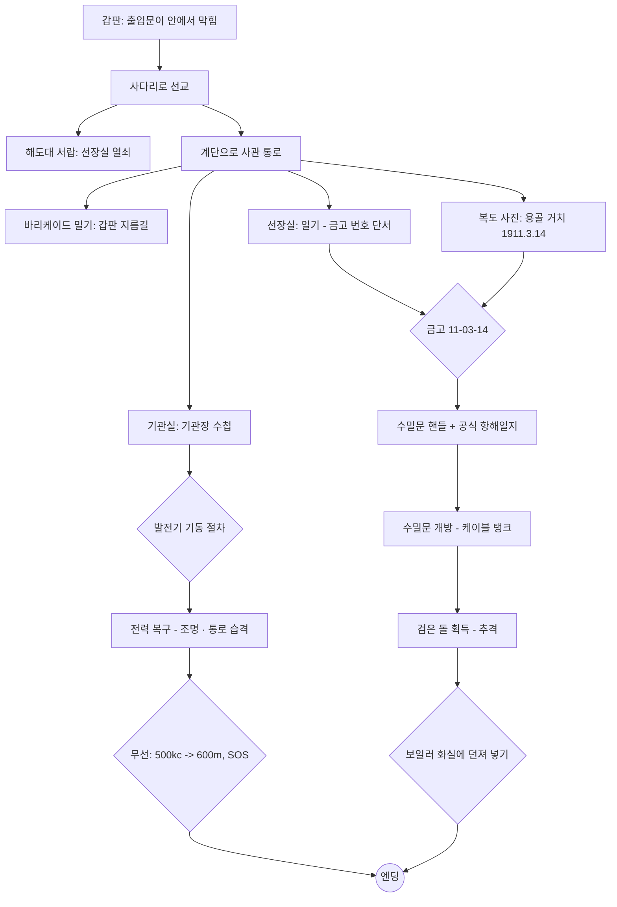

# 게임 디자인 문서 — 《용골 아래 (Beneath the Keel)》

> 1925년 10월, 북대서양. 교신이 끊긴 해저케이블 수리선에 홀로 오른 보험 조사관의 하룻밤.
> 고정 카메라 3D 탐험·퍼즐 어드벤처. Alone in the Dark(1992) 문법을 따르되 무대와 이야기는 모두 새로 만들었습니다.

## 1. 원작 문법과 이 게임의 대응

| Alone in the Dark (1992)의 요소 | 이 게임에서의 구현 | 근거 |
|---|---|---|
| 평면 색 폴리곤 캐릭터 + 미리 그린 2D 배경 + 고정 카메라 | 무텍스처 플랫 셰이딩 캐릭터 + 텍스처 배경(실시간 3D) + 방마다 2~5개의 고정 카메라 존 | [H1] |
| 캐릭터 기준 조작(위: 전진, 좌우: 회전, 아래: 후진, 위 두 번: 달리기) | 동일. 달리기는 Shift도 가능, 후세 장르 관행인 "↓+Shift 뒤로 돌기" 추가 | [H3] |
| 행동 선택(열기/찾기, 싸우기, 밀기 등) 후 Space | 상황 기반 단일 행동 키(조사·열기·줍기·밀기) + 별도 공격 키 | [H3] |
| 1920년대, 러브크래프트풍 공포 | 1925년, 심해에서 끌어올린 "검은 돌"과 익사한 선원들 | [H1] |
| 책·일기로 전달되는 이야기와 단서 | 9종 문서(보험 의뢰서, 항해일지, 선장 일기, 기관장 수첩, 무선 일지 등) | — |
| 가구를 밀어 길을 막거나 여는 퍼즐 | 선원들이 쌓은 바리케이드(옷장)를 밀어 갑판 출입문 개방 | — |

Guinness World Records는 이 게임을 "최초의 3D 서바이벌 호러 비디오게임"으로 등재했고 [H2], Resident Evil(1996)의 미카미 신지는 이 게임이 없었다면 RE가 1인칭 슈팅이 됐을 것이라고 말했습니다 [H4].

## 2. 무대와 고증

- **해저케이블 수리선(C.S., Cable Ship).** 케이블은 원형 탱크에 원뿔(cone)을 중심으로 사려 담았고, 거터퍼카 피복이 갈라지지 않도록 **탱크에 물을 채워** 두었습니다 [M1]. 선수에는 쉬브(sheave)와 권양기(picking-up gear, "cable engine")·장력계(dynamometer)가 있었습니다 [M2]. 수심 약 2,000길(fathom) 안팎에서 그래플로 케이블을 걸어 올리는 수리는 실제로 있었지만 느리고 불확실한 작업이었습니다 [M3]. 시험실에서는 미러 검류계로 저항(브리지) 시험을 해 고장 위치를 찾았습니다 [M2].
  - 참고로 영국 체신청 소속 케이블선은 1920년대에 "HMTS"를 썼고, "CS"는 민간 회사 선박에서 쓰였습니다 [M4]. 이 게임의 탈라사호는 가상의 민간 회사 소속입니다.
- **무선.** 600 m(500 kc) 파장은 1912년 런던 협약에서 선박 표준·조난 파장이 되었고, 1927년 워싱턴 규칙에서 "국제 호출·조난 파장"으로 명시됐습니다 [R1][R2]. SOS는 1906년 베를린 협약에서 채택되어 1908-07-01부터 시행됐습니다 [R3]. 선박 송신기는 배의 직류 발전기 전원을 썼고, 별도의 축전지 비상 송신 장치가 있었습니다 [R4].
- **조선 용어.** 용골 거치(keel laying)는 건조의 공식 시작, 진수(launching)는 선체를 물에 띄우는 일입니다 [S1]. 조선소 명판(builder's plate)에는 보통 조선소명·소재지·선체 번호(yard number)·건조 연도가 새겨지고 **배 이름은 드뭅니다** [S2]. 그래서 금고 번호의 단서인 날짜는 명판이 아니라 복도의 **용골 거치 기념 사진**에 넣었습니다.
- **증기 기관 절차.** 증기관은 드레인을 열고 정지 밸브를 살짝 열어 데운 뒤(warm through), 드레인에서 마른 증기가 나오면 밸브를 천천히 끝까지 열고 드레인을 닫습니다. 이를 어기면 워터해머가 생깁니다 [E1][E2]. 1920년대 상선은 3단 팽창 기관과 스카치 보일러가 표준이었고 [E3], 선내 전기는 증기기관이 돌리는 직류 발전기(대략 100~110 V)에서 나왔습니다 [E4].
- 등장하는 선박·회사·인물(탈라사호, 마그누스호, 던마로 조선소, 그레이브센드 보험조합, 헤일 선장 등)은 모두 **가상**입니다.

## 3. 공간 구성

```
                 [선교] ──계단── [사관 통로] ── 선장실
                   │               │    └──── 무선실
                 사다리        (바리케이드)
                   │               │
 [선수 갑판] ──────┘    출입문 ────┘
                                   │ 사다리
                                [기관실] ──수밀문── [1번 케이블 탱크]
```

| 방 | 크기(m) | 카메라 | 핵심 요소 |
|---|---|---|---|
| 선수 갑판 | 12×25 | 5 | 선수 쉬브로 바다에 드리운 케이블, 봉인된 해치, 권양기, 빈 대빗 |
| 선교 | 10×5.2 | 2 | 타륜, 쌍발 기관 전령기, 해도대(열쇠), 외투(브랜디) |
| 사관 통로 | 17×5 | 4 | 바리케이드, 용골 거치·진수 사진, 소화 설비함(도끼) |
| 선장실 | 6×4.4 | 2 (+금고 근접) | 일기(단서), 금고 |
| 무선실 | 4.8×3.6 | 2 (+송신기 근접) | 불꽃 송신기, 모스 부호표, 무선 일지, 시험 기록 |
| 기관실 | 14×15.5 | 5 (+발전기·화실 근접) | 3단 팽창 기관, 스카치 보일러 2기, 발전기·배전반, 수밀문 |
| 1번 케이블 탱크 | 15×15 | 5 | 물이 찬 원형 탱크, 판자 다리, 원뿔 위의 검은 돌 |

## 4. 진행 흐름과 퍼즐 (스포일러)



| # | 퍼즐 | 해법 | 설계 의도 |
|---|---|---|---|
| 1 | 막힌 출입문 | 사다리로 선교를 거쳐 안으로 들어간 뒤, 안쪽에서 바리케이드를 밀어 지름길을 연다 | 탐험 유도, 원작의 "밀기" 재해석 |
| 2 | 선장실 | 해도대 서랍의 열쇠(가지고 있으면 문 앞에서 자동 사용) | 튜토리얼 수준 |
| 3 | 소화 설비함 | 쇠지렛대로 깨거나 발차기 → 소방 도끼 | 무기 획득과 소리의 위험 |
| 4 | 금고 | 일기: "물에 처음 닿은 날이 아니라 첫 뼈대가 놓인 날, 해·달·날" → 복도 사진의 **용골 거치일** 1911-03-14 → `11-03-14`(진수일 `11-09-02`는 오답) | 조선 전문 지식이 있으면 즉시, 없어도 문서로 풀림 |
| 5 | 발전기 | 드레인 열기 → 주증기 ¼ 열기 → (마른 증기 확인) → 완전히 열기 → 드레인 닫기 → 회전계 초록 칸 → 주차단기 | 실제 증기관 운전 절차. 순서를 어기면 워터해머가 나고 그 소리가 선저의 적을 부름 |
| 6 | 무선 | 의뢰서의 500 kc와 명판의 `파장×주파수=300,000` → **600 m**, 모스 부호로 `SOS` | 단위 환산 + 모스 입력(짧게/길게 누르기) |
| 7 | 수밀문 | 금고에서 얻은 개폐 핸들 | 게이트 |
| 8 | 결말 | 검은 돌을 들고 추격을 피해 보일러 화실로(불 앞은 적이 들어오지 못하는 안전지대) | "불을 꺼뜨리지 마라"라는 복선 회수 |

엔딩 조건은 **SOS 송신**과 **검은 돌 소각** 두 가지이며 순서는 상관없습니다.

## 5. 시스템

- **카메라.** 방마다 바닥 사각형 존과 카메라(위치·주시점·FOV·추적 비율)를 정의합니다. 현재 카메라의 존 안에 있는 동안에는 전환하지 않는 **히스테리시스**로 경계에서 화면이 떨리지 않게 했습니다(`src/world/cameras.ts`). 금고·발전기·무선기는 근접 카메라로 컷합니다.
- **충돌.** 모든 캐릭터는 바닥 평면 위의 원입니다. 벽·가구는 사각형·원·선분이고, 빠른 이동에도 벽을 뚫지 않도록 5 cm 단위로 서브스텝합니다(`src/world/collision.ts`).
- **적 AI.** 25 cm 격자 A*와 시야 확인으로 가구를 돌아 추적합니다. 발소리가 한 걸음마다 빨라졌다 느려지고, 가까워지면 돌진합니다. 휘두르기 시작하면 맞아도 멈추지 않으며, 보일러 불빛 반경에는 들어오지 않습니다.
- **렌더링.** 320×240(설정에서 480·640 선택 가능) 오프스크린 렌더 → sRGB 변환 → 비네트·필름 그레인 → 4×4 베이어 디더링과 채널당 20단계 양자화 → 최근접 필터로 화면에 맞춰 확대(4:3 고정). 조명은 라이트 풀(포인트 6 + 반구 + 달빛)로 고정해 방을 오갈 때 셰이더를 다시 컴파일하지 않습니다. 정적 지오메트리는 재질별로 병합합니다. 실측 결과 프레임당 드로콜은 62(선교)~174(기관실)회, 삼각형은 1.9천~6.7천 개입니다(캐릭터·후처리 포함).
- **오디오.** 효과음과 환경음은 모두 Web Audio로 합성합니다(파도, 선체 삐걱임, 보일러 불길, 워터해머, 모스 신호음, 심장 박동 등). 강철 격실 느낌을 내려고 생성한 임펄스 응답으로 리버브를 겁니다.
- **저장.** 문을 지날 때마다 자동 기록하고, 일시정지 메뉴에서 수동 기록도 할 수 있습니다(localStorage). 죽으면 마지막 기록에서 다시 시작하며, 이때 체력은 최소 3으로 회복됩니다(죽음 반복 방지).
- **입력.** 키보드·게임패드·터치(가상 스틱과 버튼)를 같은 가상 버튼으로 통합했습니다. 한 프레임보다 짧은 탭도 놓치지 않습니다.

## 6. 검증

- 단위 테스트(Vitest) 25개: 충돌, 카메라 히스테리시스, A*, 발전기 절차(워터해머 조건 포함), 모스·파장, 금고, 세이브 검증, 한국어 조사 처리.
- 헤드리스 Chromium 전체 플레이스루: 타이틀 → 엔딩까지 실제 입력 경로와 UI 클릭만으로 진행(`scripts/playthrough.mjs`).
- 곁가지 시나리오: 워터해머 매복, 사망 → 재시작, 수동 저장 → 이어하기, 휴대폰 세로 화면 터치 조작(`scripts/scenarios.mjs`).

## 출처

- [H1] Alone in the Dark (1992): https://en.wikipedia.org/wiki/Alone_in_the_Dark_(1992_video_game)
- [H2] Guinness World Records: https://www.guinnessworldrecords.com/world-records/first-3d-survival-horror-video-game
- [H3] 조작과 행동 체계: https://strategywiki.org/wiki/Alone_in_the_Dark/Gameplay
- [H4] 미카미 신지 발언(GamesRadar 정리): https://www.gamesradar.com/games/survival-horror/alone-in-the-darks-influence-on-survival-horror-is-so-profound-that-it-saved-resident-evil-from-being-a-first-person-shooter-and-now-you-can-get-the-whole-trilogy-for-free/
- [M1] Cable ships: https://www.shippingwondersoftheworld.com/cable-ships.html
- [M2] CS Pacific: https://en.wikipedia.org/wiki/CS_Pacific
- [M3] Wilkinson, *Submarine Cable Laying and Repairing* (1908): https://lahosken.san-francisco.ca.us/frivolity/wilkinson/I_3.html
- [M4] CS Monarch (1945): https://en.wikipedia.org/wiki/CS_Monarch_(1945)
- [R1] 500 kHz: https://en.wikipedia.org/wiki/500_kHz
- [R2] 조난 주파수 역사: https://jproc.ca/rrp/distress.html
- [R3] 1906 국제무선전신협약: https://en.wikipedia.org/wiki/International_Radiotelegraph_Convention_(1906)
- [R4] Titanic의 무선 설비: https://www.encyclopedia-titanica.org/the-marconi-wireless-installation-in-rms-titanic.html
- [S1] Keel laying: https://en.wikipedia.org/wiki/Keel_laying
- [S2] Builder's plates: https://maritime-antiques.co.uk/shipbuilders-maker-plates
- [E1] Kempton Great Engines 운전 지침: https://kemptonsteam.org/wp-content/uploads/2021/09/operating-instructions-boiler-29-7-16.pdf
- [E2] Spirax Sarco, 증기 본관 드레인: https://www.spiraxsarco.com/learn-about-steam/steam-distribution/steam-mains-and-drainage
- [E3] 1930년대 화물선 기관: https://shippingwondersoftheworld.com/modern_tramp.html
- [E4] Titanic의 전기 설비: https://www.encyclopedia-titanica.org/the-electrical-equipment.html
