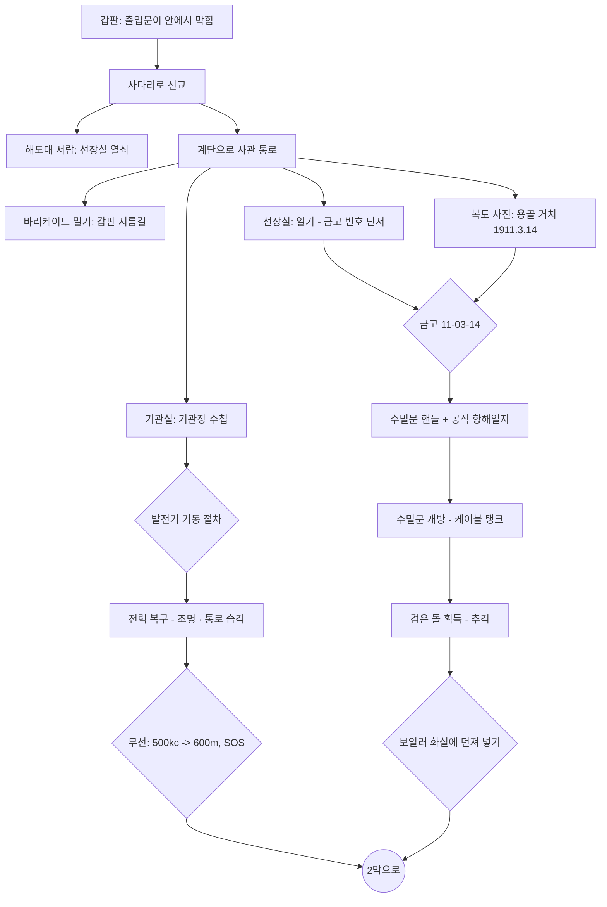
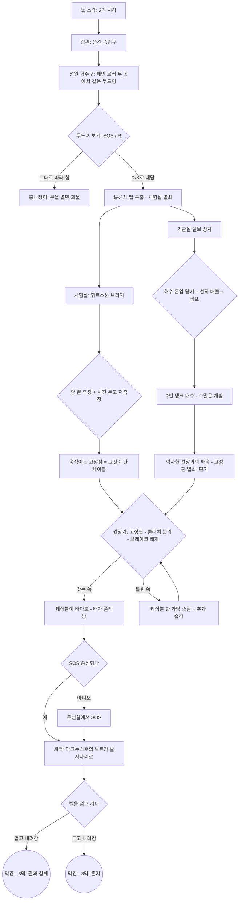
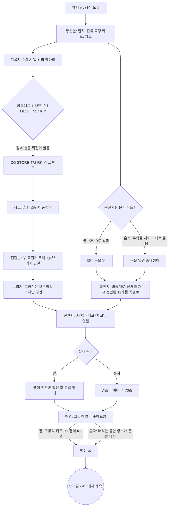
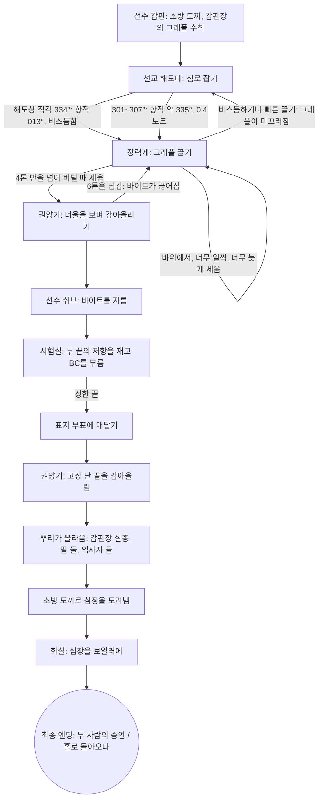

# 게임 디자인 문서 — 《용골 아래 (Beneath the Keel)》

> 1925년 10월, 북대서양. 교신이 끊긴 해저케이블 수리선에 홀로 오른 보험 조사관의 하룻밤.
> 3D 3인칭 탐험·퍼즐 어드벤처(4막 완결, 방 18개. 선택형 에필로그는 남겨 둠 — [ROADMAP.md](ROADMAP.md)). Alone in the Dark(1992) 문법을 따르되 무대와 이야기는 모두 새로 만들었습니다.
> 기본은 플레이어 추적 카메라 + 화면 기준 조작이고, 원작의 고정 카메라 + 탱크 조작은 설정에서 고를 수 있습니다.

## 1. 원작 문법과 이 게임의 대응

| Alone in the Dark (1992)의 요소 | 이 게임에서의 구현 | 근거 |
|---|---|---|
| 평면 색 폴리곤 캐릭터 + 미리 그린 2D 배경 + 고정 카메라 | 무텍스처 플랫 셰이딩 캐릭터 + 텍스처 배경(실시간 3D). 카메라는 기본이 **플레이어 추적**이고, 설정에서 방마다 2~5개의 **고정 카메라** 존으로 바꿀 수 있음 | [H1], [H6] |
| 캐릭터 기준 조작(위: 전진, 좌우: 회전, 아래: 후진, 위 두 번: 달리기) | 기본은 **화면 기준 조작**(누른 방향으로 돌아서 걷기). 원작의 캐릭터 기준(탱크) 조작은 설정에서 선택, Shift 달리기와 "↓+Shift 뒤로 돌기" 추가 | [H3], [H5] |
| 행동 선택(열기/찾기, 싸우기, 밀기 등) 후 Space | 상황 기반 단일 행동 키(조사·열기·줍기·밀기) + 별도 공격 키 | [H3] |
| 1920년대, 러브크래프트풍 공포 | 1925~26년, 심해에서 끌어올린 "검은 돌"과 익사한 선원들, 케이블을 타고 뭍으로 오는 것 | [H1] |
| 책·일기로 전달되는 이야기와 단서 | 24종 문서(보험 의뢰서, 항해일지, 선장 일기, 기관장 수첩, 무선 일지, 갑판장 수첩, 고장점 측정 요령, 배수 계통도, 선장의 마지막 편지, 회사 전보, 양륙국 소장 일지, 기록지 판독 요령, 회선 결선도, 수리 작업 지시서, 그래플 수칙, 펠의 편지 등) | — |
| 가구를 밀어 길을 막거나 여는 퍼즐 | 선원들이 쌓은 바리케이드(옷장)를 밀어 갑판 출입문 개방 | — |

**조작과 카메라를 바꾼 이유.** 탱크 조작은 고정 카메라 컷이 바뀌어도 "↑ = 캐릭터 앞"이 변하지 않게 하려는 장치였지만, 지금 플레이어에게는 가장 큰 진입 장벽입니다. 같은 장르의 후대 작품들도 같은 길을 갔습니다. Resident Evil HD 리마스터(2015)는 누른 방향으로 걷는 대체 조작을 넣으면서, 스틱을 누르고 있는 동안에는 컷이 바뀌어도 직전 카메라 기준의 방향을 유지하게 했고 [H5], 2024년 Alone in the Dark 리메이크는 고정 카메라를 버리고 어깨 너머 3인칭 카메라를 택했습니다 [H6]. 이 게임은 두 가지를 모두 따릅니다. 기본은 추적 카메라 + 화면 기준 조작이고, [H5]의 방향 유지(래치)는 방향키 입력(고정 카메라에서는 스틱도)에 적용하며, 원작 그대로의 탱크 조작도 남겨 두었습니다.

Guinness World Records는 이 게임을 "최초의 3D 서바이벌 호러 비디오게임"으로 등재했고 [H2], Resident Evil(1996)의 미카미 신지는 이 게임이 없었다면 RE가 1인칭 슈팅이 됐을 것이라고 말했습니다 [H4].

## 2. 무대와 고증

- **해저케이블 수리선(C.S., Cable Ship).** 케이블은 원형 탱크에 원뿔(cone)을 중심으로 사려 담았고, 거터퍼카 피복이 갈라지지 않도록 **탱크에 물을 채워** 두었습니다 [M1]. 선수에는 쉬브(sheave)와 권양기(picking-up gear, "cable engine")·장력계(dynamometer)가 있었습니다 [M2]. 수심 약 2,000길(fathom) 안팎에서 그래플로 케이블을 걸어 올리는 수리는 실제로 있었지만 느리고 불확실한 작업이었습니다 [M3]. 시험실에서는 미러 검류계로 저항(브리지) 시험을 해 고장 위치를 찾았습니다 [M2].
  - 참고로 영국 체신청 소속 케이블선은 1920년대에 "HMTS"를 썼고, "CS"는 민간 회사 선박에서 쓰였습니다 [M4]. 이 게임의 탈라사호는 가상의 민간 회사 소속입니다.
- **무선.** 600 m(500 kc) 파장은 1912년 런던 협약에서 선박 표준·조난 파장이 되었고, 1927년 워싱턴 규칙에서 "국제 호출·조난 파장"으로 명시됐습니다 [R1][R2]. SOS는 1906년 베를린 협약에서 채택되어 1908-07-01부터 시행됐습니다 [R3]. 선박 송신기는 배의 직류 발전기 전원을 썼고, 별도의 축전지 비상 송신 장치가 있었습니다 [R4].
- **조선 용어.** 용골 거치(keel laying)는 건조의 공식 시작, 진수(launching)는 선체를 물에 띄우는 일입니다 [S1]. 조선소 명판(builder's plate)에는 보통 조선소명·소재지·선체 번호(yard number)·건조 연도가 새겨지고 **배 이름은 드뭅니다** [S2]. 그래서 금고 번호의 단서인 날짜는 명판이 아니라 복도의 **용골 거치 기념 사진**에 넣었습니다.
- **증기 기관 절차.** 증기관은 드레인을 열고 정지 밸브를 살짝 열어 데운 뒤(warm through), 드레인에서 마른 증기가 나오면 밸브를 천천히 끝까지 열고 드레인을 닫습니다. 이를 어기면 워터해머가 생깁니다 [E1][E2]. 1920년대 상선은 3단 팽창 기관과 스카치 보일러가 표준이었고 [E3], 선내 전기는 증기기관이 돌리는 직류 발전기(대략 100~110 V)에서 나왔습니다 [E4].
- 등장하는 선박·회사·인물(탈라사호, 마그누스호, 던마로 조선소, 그레이브센드 보험조합, 헤일 선장, 통신사 펠, 전기기사 베일 등)은 모두 **가상**입니다.

### 2막의 고증

2막의 퍼즐은 케이블선의 실제 장비와 절차에서 가져왔습니다.

**조사 방법과 한계.** 자료 조사는 별도 에이전트가 했습니다. 네트워크 프록시가 atlantic-cable.com, Wikipedia, archive.org 같은 본문 페이지를 막아서 **대부분 검색 결과 요약(snippet)에 근거**합니다.
- 원칙은 사실 하나에 독립 출처 둘입니다. 출처가 하나뿐인 항목은 **[단일 출처]**로 표시했습니다.
- 이번 작업에서 핵심 수치를 다시 검색해 교차 확인했고, 결과는 아래에 함께 적었습니다.

- **권양기(picking-up gear).** 당시 명칭은 "picking-up gear / paying-out gear"이고, "cable engine"은 현대 용어입니다. 게임 UI도 PICKING-UP GEAR로 표기했습니다.
  - 케이블은 바다 → 선수 쉬브 → 장력계(dynamometer) 쉬브 밑 → 드럼(3~5바퀴 감아 마찰로 붙잡음) → 탱크 순서로 지나갑니다 [C1][C2].
  - 선수 쉬브는 셋이 흔했습니다(Faraday, 1923). 겹(double) 권양 장치를 갖춘 배도 있었습니다(Colonia, John W. Mackay) [C3].
  - 브레이크는 레버로 조이는 띠 브레이크("brake-strap")였습니다 [C2][단일 출처].
  - 케이블을 내보낼 때는 "권양기를 기어에서 빼고 브레이크로 제어"했습니다(CS Alert, 1890) [C4][단일 출처].
  - 게임의 해제 순서(**고정핀 → 클러치 분리 → 브레이크 해제**)는 이 절차를 따랐습니다. 고정핀과 자물쇠는 선장이 덧붙인 것으로 설정한 **창작**입니다. 클러치가 도그식인지 마찰식인지는 자료를 찾지 못했습니다.
- **케이블 탱크.**
  - 원형 수밀 탱크 가운데에 원뿔(cone)이 있었습니다. 거터퍼카가 마르면 갈라지므로 물을 "맨 윗 사리 몇 인치 아래까지" 채웠습니다 [M1][C5].
  - 사리 위에 매다는 강관 틀 "크리놀린(crinoline)"은 1896년 기록이 있고, 튀어 오르는 케이블 고리를 막는 장치입니다 [C5].
  - 사리가 엉켜 드럼을 멈춰 세운 사고("foul flake")도 기록돼 있습니다 [C6].
- **고장점 측정(시험실).** 핵심 수치는 아래 표에 모았습니다.
  - 완전 단선("total break", 당시 표현으로 "full ground")이면 **측정한 도체 저항 ÷ 해리당 도체 저항 = 고장점까지 거리**입니다 [T1].
  - 끊어진 구리 끝이 제 저항을 보태므로 계산값은 실제보다 멉니다. 게임 속 측정 요령 카드의 주의 문구가 이것입니다.

| 항목 | 값 | 근거·교차 확인 |
|---|---|---|
| 300 lb 심선의 해리당 저항 (24 °C) | 4.272 Ω | 1866년 대서양 케이블 기록 [T2][단일 출처]. 이번 재검색에서도 원문 확인에 실패해, 아래 물리 계산으로 검증함 |
| 같은 심선, 순수 연동(100 % IACS) 가정 | 3.86 Ω (20 °C) | 300 lb = 136 kg, 밀도 8.89 g/cm³ → 단면 8.27 mm², 비저항 1.724×10⁻⁸ Ω·m로 계산(**자체 계산**). 4.272 Ω는 도전율 약 92 % IACS(연선 꼬임 포함)에 해당해 1860년대 구리로 무리가 없음 |
| 구리 저항 온도계수 | +0.393 %/°C | [T3] |
| 해저 수온 약 3 °C에서 | **약 3.9 Ω/해리** (게임 값) | 4.272 Ω(24 °C)를 3 °C로 환산하면 3.93 Ω(**자체 계산**). 순수 연동 가정이면 3.61 Ω |

  - **우체국 상자(Post Office box) 브리지.** 비율 팔은 10·100·1000 Ω이고, 균형이면 X = R·Q/P입니다 [T4, 재검색으로 확인]. 다이얼(데케이드)식은 1903~07년 무렵 있었습니다 [T4].
  - **검류계 분류기.** 1/9·1/99·1/999 분류기는 감도를 1/10·1/100·1/1000로 낮춥니다 [T5, 재검색으로 확인]. 거친 균형은 분류기를 끼우고 잡고, 마지막 자리는 분류기를 빼고 맞춥니다.
  - **미러 검류계.** 톰슨의 선박용 미러 검류계가 있었고 [T6], 선박의 움직임이 검류계 측정을 방해한다는 1886년 기록이 있습니다 [T7][단일 출처]. 그래서 시험실은 사관 구역(선체 중앙)에 두었습니다.
  - **단순화.** 실제 절차는 같은 비율 팔로 R₀와 R₀+1(편향이 반대)을 찾은 뒤 비율을 바꿔 소수 자리를 읽습니다 [T4]. 게임은 "값이 넘치지 않는 가장 작은 비율 팔로 네 다이얼을 다 쓴다"로 줄였습니다.
- **빌지·밸러스트 밸브 상자.**
  - 1916년 선박 기관사 교범에 "Bilge Suction Valve Chest" 항목이 있습니다 [B1].
  - 1912년 타이타닉 조사 보고서에는 빌지·밸러스트 펌프와 교차 연결된 이중 본관이 나옵니다 [B2].
  - 빌지 흡입관에는 나사 내림식 역지 밸브(screw-down non-return valve)가 있습니다 [B1][B3].
  - 흡입관이 밸브 상자에 열린 채 해수 흡입까지 열려 있으면, 바닷물이 관을 거꾸로 타고 구획으로 들어갑니다 [B3]. 이 침수 기전은 현대 손해예방 자료에 나오지만 원리는 같습니다.
  - **게임상 가정.** 케이블 탱크의 물을 어떻게 넣고 뺐는지는 자료를 찾지 못했습니다. 그래서 밸러스트 계통(양방향이라 역지 밸브가 없음)으로 탱크를 채우고 비운다고 **가정**했습니다.
- **선수루와 체인 로커.**
  - 체인 로커는 선수루 아래, 충돌 격벽 앞에 있습니다. 닻사슬은 로커 → 스펄링 파이프 → 양묘기 → 호스 파이프로 이어집니다 [F1].
  - 선원은 선수루에서 살았고, 오래된 배에서는 닻사슬이 거주 공간을 지나가기도 했습니다 [F2].
- **모스 응답.** 1906년 규정에서 `K`(− · −)는 "송신하라(invitation to transmit)"였습니다. 1912년 규정(1914년 재인쇄)에서 `R`은 "수신함"이었습니다 [R5].
  - 펠이 SOS에 `R`, R에 `K`로 답하는 것은 이 관례를 따랐습니다. 메아리만 하는 괴물과 구별되도록 **절대 같은 신호를 돌려주지 않습니다**.
- **창작(사실 아님).**
  - 잘라 낸 케이블의 양 끝을 동시에 선수 쉬브에 걸어 두는 것. 실제로는 성한 끝을 봉해 부표에 매달고, 고장 난 끝만 끌어올렸습니다 [M1].
  - 시험실 단자반의 B·C 끝 표기.
  - 고장점이 시간에 따라 다가오는 것(시간당 약 0.54해리).

### 3막의 고증

3막은 1926년 2월, 뉴펀들랜드 트리니티만의 가상 케이블 양륙국 '벨 코브'가 무대입니다. 실재한 하츠 콘텐트 케이블국(트리니티만, 1866년 양륙, 1965년 폐쇄)을 모델로 했습니다 [L1].

**조사 방법.** 2막과 같습니다. 본문 페이지가 프록시에 막혀 대부분 검색 결과 요약으로 확인했고, 사실 하나에 독립 출처 둘을 원칙으로 했습니다.

- **사이펀 기록계와 케이블 코드.** 톰슨의 사이펀 기록계(1867)는 가는 유리 사이펀이 종이 테이프에 잉크 선을 그립니다 [L2]. 케이블에서는 점과 선의 길이가 같고, **전류의 방향**으로 구별합니다. 잉크 자국이 한 방향의 전류에는 위로, 반대 방향에는 아래로 흔들립니다(게임에서는 위가 점, 아래가 선) [L3].
  - 그래서 극성이 뒤집혀 돌아온 신호는 점과 선이 모두 바뀌어 찍힙니다. 이것이 3막의 핵심 퍼즐입니다.
  - 국제 모스 부호의 숫자는 다섯 자리입니다 [L4]. 점과 선을 모두 바꾸면 숫자 d는 (d+5) mod 10이 됩니다(1↔6, 2↔7, 3↔8, 4↔9, 5↔0, **자체 계산**, 단위 테스트로 확인).
  - 4자리 부호 16가지 중 문자는 12개뿐입니다. 비어 있는 4자리(··−−, ·−·−, −−−·, −−−−)의 짝인 C·Z·V·H는 뒤집으면 읽히지 않는 글자(?)가 됩니다(**자체 계산**). 게임 속 메아리에 C가 들어 있어, 그대로 읽으면 '?'가 섞입니다.
- **신호용 축전기.** 배리가 1862년 특허를 낸 신호용 축전기는 케이블과 계기 사이에 **직렬로** 들어갔습니다 [L5]. 축전기는 직류를 통과시키지 않으므로, 넣은 채로 저항 시험을 하면 회선이 끊긴 것처럼 읽힙니다(물리 원리). 게임의 결선도는 축전기를 케이블과 모든 계기 사이에 두고 우회 고리로 건너뛰게 했습니다.
- **피뢰기.** 전신국에는 회선과 계기 사이에 회선과 땅을 잇는 작은 공기 간극(바늘끝·톱니판)이 있었습니다. 높은 서지는 간극을 건너 땅으로 빠지고 평소 신호 전류는 막힙니다 [L6]. 배리의 진공 피뢰기(1861)도 있었습니다 [L6]. 게임은 "코일의 고압도 이 간극으로 빠진다"고 **가정**했습니다. 실제로 건너뛸지는 간극 간격에 달려 있습니다.
- **유도 코일.** 1836년 칼런이 처음 만들었고, 1851년 룸코르프의 특허 코일이 해머 단속기와 축전기를 갖춘 표준형이 됐습니다. 1차는 단속기로 끊었다 이었다 하며, 2차에 높은 전압이 생깁니다 [L7].
  - 1858년 첫 대서양 케이블에서 화이트하우스는 5피트 유도 코일로 약 2,000 V(추정)를 걸었고, 케이블은 약 3주 만에 죽었습니다. 제조 결함도 원인이었다는 현대 분석이 있습니다 [L8]. 꼬리표 문구는 두 견해를 모두 적었습니다.
- **납축전지와 비중계.** 완충 비중은 약 1.265(셀에 따라 1.275~1.280), 방전은 약 1.120입니다. 비중계는 고무 구로 전해액을 빨아올려 뜨개 눈금을 읽습니다 [L9]. 게임은 1.250 이상을 '양호'로 단순화했고, 셀당 약 2 V × 12개 = 24 V로 코일 1차를 맞췄습니다(1차 전압은 **창작**).
- **해안 구간과 케이블 오두막.** 해안 구간은 바위·파도·닻에 견디도록 가장 두꺼운 외장(이중 철선, 마일당 15~20톤까지)을 썼고, 심해형은 마일당 1.5~3톤이었습니다 [L10]. 해안 끝은 해변의 케이블 오두막에서 육선과 이어졌습니다(포스커노의 케이블 오두막) [L11].
- **모스 응답.** `K`는 "송신하라(invitation to transmit)", `R`은 "수신함"입니다 [R5]. 오두막 신호 절차(내가 R → 펠이 K로 물음 → 내가 R로 답함)는 이 관례를 쓴 **창작**입니다. 흉내만 내는 괴물은 K를 받으면 K를 돌려줄 뿐입니다.
- **표준시.** 처음엔 GMT를 뉴펀들랜드 시각으로 바꾸는 퍼즐을 구상했습니다. 그런데 UTC−3:30 표준시는 1935년에 법제화됐고 1926년에는 통일된 표준시가 없었으므로 버렸습니다 [L12].
- **창작(사실 아님).**
  - 벨 코브 양륙국, 캐리긴국, 앨비언 대서양전신회사와 소장 커크패트릭 등 인물
  - 역에 화이트하우스 시절과 같은 코일이 보관돼 있다는 것, 그것이 고장점에서 불타는 것
  - 고압 스위치 손잡이를 뽑아 잠가 두는 것, 양초로 끈을 태워 스위치를 넣는 타이머
  - 고장점이 시간에 따라 해안으로 다가오는 것(2막과 같은 하루 약 13해리, 해안 구간에서는 분당 수 미터)

### 4막의 고증

4막은 1926년 4월, 회사 수리선 세인트 브렌던호가 탈라사호가 케이블을 놓아 보낸 자리(벨 코브 기점 1,036해리)로 돌아가 케이블을 건져 올리는 이야기입니다. 그래플 끌기에서 끝 시험, 부표, 끌어올리기까지 실제 수리 순서를 따랐습니다.

**조사 방법.** 앞 막들과 같습니다. 사실 하나에 독립 출처 둘을 원칙으로 했고, 하나뿐이면 [단일 출처]로 적었습니다.

- **그래플 끌기.** 그래플을 바닥까지 내린 뒤 케이블의 선과 **직각으로, 거의 서 있는 듯 아주 느리게** 배를 몹니다. 느릴수록 잘 뭅니다 [M3]. 그래플 로프는 선수 쉬브를 지나 장력계에 걸립니다. 바위에 걸리면 장력이 갑자기 높이 치솟고, 케이블을 물면 **꾸준한 속도로** 오릅니다 [C1][M3].
  - 확실히 물린 뒤에도 몇 분 더 앞으로 끌어 케이블을 바닥에서 띄운 다음, 배를 세우고 감아올립니다 [M3].
  - 깊은 바다에서는 끊긴 끝에서 너무 먼 곳을 물면 무게 때문에 그래플에서 다시 끊어지고, 너무 가까운 곳을 물면 감는 도중 끝이 빠져나갔습니다 [M3]. 게임은 이 두 실패를 **배를 세우는 시점**의 문제로 바꿨습니다(너무 이르면 빠지고, 너무 늦으면 끊어짐). 이것은 창작입니다.
  - 그래플 앞에는 사슬을 달았고, 1,200길이 넘는 바다에서는 삼실을 감은 특수 강철 로프를 썼습니다 [M3]. 그래플·사슬·와이어 로프의 파단 강도는 22~30톤이었습니다 [C1][단일 출처].
- **1865~66년의 선례.** 1865년 8월 2일 그레이트 이스턴호는 고장을 고치려고 케이블을 감아올리다 약 2,000길 바다에서 케이블을 끊어 먹었습니다 [G1][G2]. 이듬해 캐닝은 여러 번 실패한 끝에 1866년 9월 2일 그 케이블을 건져 올려 이었습니다 [G2]. 건져 올린 끝은 갑판을 따라 전기기사의 방으로 끌려가, 살아 있는지 죽었는지 시험을 받았습니다 [G2][단일 출처].
- **끊고, 시험하고, 부표에 달기.** 케이블을 끊은 뒤 한쪽 끝을 육지국까지 시험해서, 깨끗하게 나오면 봉해 부표에 매달아 둡니다. 다른 끝을 끌어올려 상한 구간을 잘라 내고 새 케이블을 이은 다음, 부표의 끝까지 가져가 마무리 접속(final splice)을 합니다 [G3][C1]. 이 출처들은 현대 문서이므로 1926년 절차와 세부가 같다고 단정하지는 않았습니다.
- **표지 부표와 버섯 닻.** 수리선은 고장 위치에 닿으면 먼저 표지 부표를 내렸습니다. 부표는 7~37 cwt, 계류용 버섯 닻은 3~7 cwt였습니다 [C1]. 버섯 닻은 부표 계류와 케이블 끝을 묶는 데 썼습니다 [G4]. 게임은 표지 부표 하나가 위치 표시와 성한 끝 매달기를 겸하게 단순화했습니다.
- **끌어올리기.** 그래플은 권양기 드럼으로 감아올리고, 쉬브까지 올라온 케이블은 줄에 매단 작업 의자(boatswain's chair)를 타고 뱃머리 밖으로 내려간 선원들이 사슬과 밧줄로 붙잡아 맸습니다 [C1][단일 출처].
  - 배가 너울에 오르내리면 케이블 장력이 커집니다. 오늘날 케이블선이 선수 모양을 바꿔 배의 움직임을 줄이는 이유입니다 [G5]. 게임의 너울 주기 7초, 한 번에 1.2톤, 한계 6톤은 게임 값입니다.
- **조류와 실제 항적.** 배가 실제로 지나간 길(course made good)은 배의 침로·속력 벡터에 조류(set and drift) 벡터를 더해 구합니다 [G6].
  - 게임은 정선 중 표류로 잰 조류(100° 쪽 0.5노트, 게임 값)를 해도에 적어 둡니다. 해도상 직각인 334°로 몰면 실제 항적은 013°가 되어 케이블과 51°로 비스듬히 지나갑니다(자체 계산, 단위 테스트로 확인).
  - 1925년 이 해역의 자기 편차는 검증 가능한 값을 찾지 못해 쓰지 않았습니다. 게임의 방위는 모두 진방위입니다.
- **끝 시험의 수치.** 2막의 심선 저항 3.9 Ω/해리 [T2][T3]를 그대로 씁니다. 벨 코브까지 1,035.4해리인 끝은 약 4,038 Ω이고, 0.8해리 앞 고장점에서 땅에 닿는 끝은 약 3.1 Ω입니다. 완전 단선까지의 거리는 저항 ÷ 해리당 저항이라는 원리 [T1]에 따른 자체 계산입니다.
- **모스.** R(·−·)을 극성 반전하면 K(−·−), B(−···)는 J(·−−−)가 됩니다. C(−·−·)를 반전한 ·−·−는 국제 부호에 없습니다. 3막과 같은 자체 계산입니다.
- **창작(사실 아님).**
  - 세인트 브렌던호, 레니 선장, 갑판장 스톤, 전기기사 로스, 이등항해사의 실종
  - 고장 위치 1,036.2해리, 수심 약 2,100길, 극미속 0.8노트, 장력 수치(3톤, 4톤 반, 5톤, 6톤), 두세 시간의 끌기를 80초로 줄인 것
  - 판마다 바뀌는 바닥(바위와 케이블의 위치), 어느 끝이 벨 코브인지(A/B 무작위)
  - 고장 난 끝의 뒤집힌 메아리와 "R", 뿌리와 심장, 배의 화실에서 태우기

## 3. 공간 구성

```
                 [선교] ──계단── [사관 통로] ── 선장실
                   │               │    ├──── 무선실
                 사다리        (바리케이드) └── 시험실(2막, 펠의 열쇠)
                   │               │
 [선수 갑판] ──────┘    출입문 ────┘
     │ 승강구(2막)                 │ 사다리
 [선원 거주구]                  [기관실] ──수밀문── [1번 케이블 탱크]
  └ 체인 로커 ×2               (밸브 상자)            │ 수밀문(2막, 배수 후)
                                                [2번 케이블 탱크]
```

3막의 벨 코브 양륙국은 방 넷입니다.

```
        [통신실] ──문── [축전지·시험실]
           │ 문            (전환반·코일·축전지·브리지·창고)
 [소장 관사]─[역 마당]──── 전신주를 따라 ──── [해변의 케이블 오두막]
  (잠김)     │ 대문(나갈 수 없음)                 └ 해저선이 바다로
```

4막의 세인트 브렌던호도 방 넷입니다. 모두 선수 갑판에서 갈라집니다.

```
                  [선교]  해도대·타륜
                    │ 사다리
 [시험실] ──문── [선수 갑판] ──승강구── [화실]
  두 끝·브리지      권양기·장력계·쉬브      보일러 2기
                  표지 부표·소화 설비함
```

| 방 | 크기(m) | 카메라 | 핵심 요소 |
|---|---|---|---|
| 선수 갑판 | 12×25 | 5 | 선수 쉬브로 바다에 드리운 케이블, 봉인된 해치, 권양기, 빈 대빗 |
| 선교 | 10×5.2 | 2 | 타륜, 쌍발 기관 전령기, 해도대(열쇠), 외투(브랜디) |
| 사관 통로 | 17×5 | 4 | 바리케이드, 용골 거치·진수 사진, 소화 설비함(도끼) |
| 선장실 | 6×4.4 | 2 (+금고 근접) | 일기(단서), 금고 |
| 무선실 | 4.8×3.6 | 2 (+송신기 근접) | 불꽃 송신기, 모스 부호표, 무선 일지, 시험 기록 |
| 기관실 | 14×15.5 | 5 (+발전기·화실 근접) | 3단 팽창 기관, 스카치 보일러 2기, 발전기·배전반, 수밀문 |
| 1번 케이블 탱크 | 15×15 | 5 | 물이 찬 원형 탱크, 판자 다리, 원뿔 위의 검은 돌, 2번 탱크로 가는 수밀문 |
| 선원 거주구 (2막) | 8.8×10 | 2 | 이층 침상, 식탁, 난로, 좌·우현 체인 로커 문, 승강구 사다리 |
| 케이블 시험실 (2막) | 4×3.6 | 1 (+브리지 근접) | 휘트스톤 브리지, 미러 검류계, 전지, 단자반 |
| 2번 케이블 탱크 (2막) | 지름 10.4 | 2 | 물을 뺀 탱크 바닥, 원뿔과 사리, 크리놀린, 선장의 시신 |
| 벨 코브 역 마당 (3막) | 20×15 | 3 | 눈 내리는 마당, 역사 정면, 소장 관사, 장작더미(장작 도끼), 전신주 |
| 통신실 (3막) | 10×7 | 2 | 사이펀 기록계 두 대, 기록지, 소장의 책상(일지), 난로 선반(양초·럼) |
| 축전지·시험실 (3막) | 8×6 | 2 (+전환반·축전지·브리지·코일 근접) | 회선 전환반, 납축전지 16개, 휘트스톤 브리지, 5피트 유도 코일, 창고 |
| 해변의 케이블 오두막 (3막) | 18×13.6 | 4 | 콘크리트 오두막, 육선 키, 소장의 시신, 바다로 들어가는 해안 구간 케이블 |
| 세인트 브렌던호 선수 갑판 (4막) | 12×22 | 5 (+장력계·권양기 근접) | 선수 쉬브 셋, 장력계, 권양기, 표지 부표와 버섯 닻, 그래플 로프, 소화 설비함(소방 도끼), 갑판장 |
| 세인트 브렌던호 선교 (4막) | 10×5.2 | 2 (+해도대 근접) | 해도대(침로), 타륜을 잡은 선장, 기관 전령기 |
| 세인트 브렌던호 시험실 (4막) | 5×4 | 1 (+시험대 근접) | 단자반과 잘라 낸 두 끝, 브리지·미러 검류계, 시험 키, 전기기사, 브랜디 |
| 세인트 브렌던호 화실 (4막) | 10×7.6 | 2 (+화실 근접) | 스카치 보일러 2기, 석탄 더미, 갑판으로 오르는 사다리 |

## 4. 진행 흐름과 퍼즐 (스포일러)

### 4.1 1막 — 검은 돌



| # | 퍼즐 | 해법 | 설계 의도 |
|---|---|---|---|
| 1 | 막힌 출입문 | 사다리로 선교를 거쳐 안으로 들어간 뒤, 안쪽에서 바리케이드를 밀어 지름길을 연다 | 탐험 유도, 원작의 "밀기" 재해석 |
| 2 | 선장실 | 해도대 서랍의 열쇠(가지고 있으면 문 앞에서 자동 사용) | 튜토리얼 수준 |
| 3 | 소화 설비함 | 쇠지렛대로 깨거나 발차기 → 소방 도끼 | 무기 획득과 소리의 위험 |
| 4 | 금고 | 일기: "물에 처음 닿은 날이 아니라 첫 뼈대가 놓인 날, 해·달·날" → 복도 사진의 **용골 거치일** 1911-03-14 → `11-03-14`(진수일 `11-09-02`는 오답) | 조선 전문 지식이 있으면 즉시, 없어도 문서로 풀림 |
| 5 | 발전기 | 드레인 열기 → 주증기 ¼ 열기 → (마른 증기 확인) → 완전히 열기 → 드레인 닫기 → 회전계 초록 칸 → 주차단기 | 실제 증기관 운전 절차. 순서를 어기면 워터해머가 나고 그 소리가 선저의 적을 부름 |
| 6 | 무선 | 의뢰서의 500 kc와 명판의 `파장×주파수=300,000` → **600 m**, 모스 부호로 `SOS` | 단위 환산 + 모스 입력(짧게/길게 누르기) |
| 7 | 수밀문 | 금고에서 얻은 개폐 핸들 | 게이트 |
| 8 | 결말 | 검은 돌을 들고 추격을 피해 보일러 화실로(불 앞은 적이 들어오지 못하는 안전지대) | "불을 꺼뜨리지 마라"라는 복선 회수 |

1막은 검은 돌을 태우면 끝나지만, 이야기는 거기서 끝나지 않습니다. SOS는 1막에서 보내도 되고 2막 끝에 보내도 됩니다.

### 4.2 2막 — 선수창 아래

돌이 불 속에서 죽자, 선수에 걸린 케이블을 저 아래의 무언가가 끌어당기기 시작합니다. 화면이 아주 조금 선수 쪽으로 기울어(트림) 배가 끌려가고 있음을 보여 주고, 2막의 적들이 새로 나타납니다.



| # | 퍼즐 | 해법 | 설계 의도 |
|---|---|---|---|
| 9 | 두 개의 두드림 | 두 체인 로커 문에 SOS나 R을 두드려 본다. 그대로 따라 치는 쪽은 흉내쟁이이고, `R`/`K`로 **대답**하는 쪽이 펠이다. 갑판장 수첩: "진짜 사람은 두드림을 따라 하지 않는다. 대답을 한다." | 1막의 "세 번, 쉬고, 세 번"을 뒤집는 반전. 어느 쪽인지는 매 판 무작위 |
| 10 | 고장점 측정 | B(좌현)·C(우현) 끝을 각각 브리지로 잰다. 한쪽은 육지국까지 1,037해리(4,044 Ω, ×1 비율), 다른 쪽은 2해리 남짓의 완전 단선(×0.01 비율). 시간을 두고 다시 재면 단선 지점이 **배 쪽으로 다가온다** | 실제 계측 절차(비율 팔·분류기·영점 균형)를 그대로 손으로 해 보는 퍼즐. 측정 전에는 브레이크를 풀지 않는다 |
| 11 | 2번 탱크 배수 | 처음 상태는 ①해수 흡입과 ③2번 탱크 흡입이 열린 채 펌프 정지(바닷물 역류). ①을 닫고 ⑤선외 배출을 열고 펌프 기동. 배출을 안 열면 헛압(dead head), 해수를 연 채면 바다를 퍼 올릴 뿐 | 배관 계통도 한 장으로 푸는 기관실 실무 퍼즐 |
| 12 | 선장 | 탱크 바닥의 헤일 선장이 일어선다(체력 6, 한 대에 2. 팔을 치켜들 때 물러났다가 회복하는 틈에 친다). 원뿔 사다리에 묶인 꾸러미에 고정핀 열쇠와 마지막 편지 | 보스전 |
| 13 | 케이블 놓아 보내기 | 고정핀 자물쇠 → 해당 드럼 클러치 분리 → 브레이크 해제. 클러치를 문 채 브레이크를 풀면 기관째 끌려 돈다. 틀린 쪽을 풀면 케이블 한 가닥을 잃고 습격이 늘어난다 | 1890년 기록의 "기어에서 빼고 브레이크로 제어" [C4] |

**2막의 끝(막간).** 케이블을 놓고 SOS를 보내면 새벽이 오고, 마그누스호의 보트가 처음 타고 올라온 줄사다리 아래로 옵니다. 줄사다리를 내려가면 2막의 결말이 막간으로 나오고 3막으로 이어집니다(최종 엔딩은 4막으로 옮김).
- 펠은 구출할 때 "케이블을 놓거든, 데리러 와 주시오"라고 말합니다.
- 선원 거주구로 돌아가 그를 업고 줄사다리를 내려가면, 막간에서 펠은 다시는 배를 타지 않고 뭍의 케이블국에 자리를 얻습니다. 3막에서 그는 벨 코브의 야간 통신사입니다.
- 그를 두고 내려가면(줄사다리에서 한 번 더 묻습니다) 내려가기 직전 선수에서 "세 번, 쉬고, 세 번" 두드림이 들리고, 조사관은 돌아보지 않습니다. 3막은 혼자입니다.
- 펠을 구하지 않으면 시험실 열쇠가 없어 케이블을 놓을 수 없습니다. 그래서 갈림길은 펠을 구한 뒤의 선택입니다.

**난이도 설계.**
- 고장점은 플레이 시간 기준으로 약 0.00015해리/초씩 다가옵니다(최저 0.3해리).
- ×0.01 비율에서 다이얼 한 칸(0.01 Ω)이 바뀌는 데 약 17초가 걸립니다. 그래서 균형을 잡을 시간은 넉넉하고, 1분 뒤에 다시 재면 두세 칸 줄어든 것이 보입니다.
- 균형 판정 허용치는 max(0.2 %, 다이얼 한 칸의 0.6배)입니다. 몇 시간을 플레이해도 항상 맞출 수 있는 값이 있습니다(단위 테스트로 6시간 구간 전체를 확인).

### 4.3 3막 — 뭍으로

2막의 줄사다리를 내려가면 막간(2막의 결말)이 나오고, 넉 달 뒤 1926년 2월의 벨 코브에서 3막이 시작됩니다. 2막에서 놓아 보낸 케이블 끝은 12월에 회사 수리선이 건져 새 케이블을 이었고, 그것은 그 끝에 있었습니다.
- 소지품은 랜턴과 회사 전보만 남고, 체력은 가득 찹니다. 1·2막의 상태는 남기지 않고 **펠을 데리고 내려왔는지**만 이어받습니다.
- 펠을 업고 내려왔다면 펠이 벨 코브의 야간 통신사로 축전지실에 버티고 있습니다. 두고 내려왔다면 그 자리에 흉내쟁이가 있고, 혼자 양초 타이머로 결전을 치릅니다.



| # | 퍼즐 | 해법 | 설계 의도 |
|---|---|---|---|
| 14 | 뒤집힌 메아리 | 기록지의 마지막 전문은 소장이 캐리긴에 보낸 창고 번호의 **메아리**다. 카드대로 읽으면 "?U OESKT 927 KR"처럼 읽히지 않는 글자가 섞인다. 점과 선을 모두 바꿔 읽으면 "CG STORE 472 RK"가 된다. 메아리 숫자(927)를 그대로 넣으면 열리지 않는다(두 번 틀리면 일지, 네 번이면 숫자표 힌트) | 역의 송신은 역 기록지에 남지 않으므로, 소장의 마지막 전문은 괴물의 메아리로만 남아 있다. 번호는 매 판 무작위 |
| 15 | 문 너머의 두드림 | 펠은 `K`로 묻는다. `R`로 답하면 연다. `K`를 따라 치면 대답이 끊긴다. 혼자일 때는 무엇을 쳐도 그대로 돌아온다 | 2막의 노크 퍼즐을 뒤집어, 결전의 신호 절차를 미리 가르친다 |
| 16 | 축전지 고르기 | 비중계로 16개를 하나씩 재고 1.250 이상인 12개만 연결띠로 잇는다. 약한 셀이 하나라도 섞이면 단속기가 서지 않는다 | 셀 배치는 매 판 무작위. 충전 12, 부족 3, 방전 1 |
| 17 | 회선 전환과 해안 측정 | ② 신호 축전기를 우회하고 ④ 브리지를 물려 잰다. 축전기를 넣은 채면 "단선"으로 읽힌다. 고장점은 오두막 너머 바다 쪽으로 수백 미터, 재는 동안에도 다가온다 | 2막 브리지의 응용. 비율 팔 ×0.01, 다이얼 한 칸(0.01 Ω)이 약 32초 |
| 18 | 고압 회선 | ① 기록계, ③ 피뢰기, ④ 브리지를 떼고 ⑤ 코일만 물린다. 남은 것이 있으면 그쪽이 방전을 먹는다(피뢰기는 땅으로, 축전기는 관통, 기록계·브리지는 탐) | 코일을 쏠 때마다 12초 식혀야 한다 |
| 19 | 결전 | 펠: 오두막 육선 키로 `R`을 보낸다. 괴물의 메아리 `R`, 펠의 `K`, 괴물의 `K`가 돌아온다. `R`로 답하면 펠이 쏜다. 혼자: 양초를 세우고(약 70초) 해변으로 달려가, 그것이 솟아 있는 동안 버틴다. 그것이 솟아 있지 않을 때 쏘면 헛방 | 팔은 칼로 죽지 않는다(맞으면 움찔할 뿐, 사거리 3.3 m, 한 대에 2) |

**3막의 끝.** 방전이 오두막에서 바다 쪽으로 케이블을 따라 달려 나가고, 그것의 팔이 숯처럼 무너집니다. 다음 날 캐리긴과의 교신이 돌아오지만, 기록지에는 메아리가 하나 더 찍힙니다(펠과 함께면 R 하나, 혼자면 "세 번, 쉬고, 세 번"). 불이 태운 것은 그것의 손 하나였고, 뿌리는 탈라사호가 케이블을 놓아 보낸 바다 밑에 남아 있습니다. 회사는 봄에 수리선을 보내기로 하고, 조사관은 그 배에 타겠다고 합니다. "— 3막 끝 —" 다음에 곧바로 4막이 시작됩니다.

### 4.4 4막 — 갈고리

1926년 4월 19일, 세인트 브렌던호가 벨 코브 기점 1,036해리, 탈라사호가 케이블을 놓아 보낸 자리에 닿습니다. 사흘째 밤에 이등항해사가 사라졌습니다. 갑판에는 뱃전에서 시작된 젖은 발자국만 남았습니다.
- 소지품은 랜턴, 작업 지시서, 그리고 펠의 편지(펠과 함께였을 때) 또는 벨 코브의 전보(혼자였을 때)입니다. 체력은 가득 찹니다.
- 펠은 배에 타지 않고 벨 코브의 회선 끝에 앉아 있습니다. 그래서 두 끝을 시험할 때 "R 다음에 TP"로 답하는 사람이 됩니다. 혼자였다면 새 근무자가 "R BC"로 답합니다.



| # | 퍼즐 | 해법 | 설계 의도 |
|---|---|---|---|
| 20 | 조류 삼각형 | 해도는 334°가 케이블(064°)과 직각이라고 합니다. 하지만 표류 기록의 조류(100° 쪽 0.5노트)를 더하면 실제 항적은 013°이고, 케이블을 51°로 지나갑니다. 침로를 301~307°로 잡으면 항적이 약 335°(직각), 대지 속력이 0.4노트가 됩니다. 반대 방향으로 직각을 맞추면 조류를 등에 업어 1.2노트로 너무 빠릅니다 | 뱃머리 방향과 실제 항적의 차이를 눈으로 보게 합니다. 패널은 침로·조류·항적의 벡터 삼각형과 교차각·대지 속력을 보여 줍니다 |
| 21 | 장력계 판독 | 바위는 바늘이 확 튀었다 떨어지고, 케이블은 꾸준히 오릅니다. 4톤 반을 넘어 버틸 때 기관을 세웁니다. 바위에서 세우면 빈 그래플이 올라오고, 첫 바위에서는 사람 손가락이 함께 걸려 옵니다. 너무 일찍 세우면 빠지고, 5톤을 넘겨 끌면 끊어집니다. 침로가 틀리면 바늘이 잠깐 들렸다 마는데, 그래플이 미끄러져 넘어간 것입니다 | 두세 시간의 끌기를 80초로 줄였습니다. 들리기 시작해서 끊어질 때까지 약 14.5초입니다. 바닥은 끌 때마다 바뀝니다 |
| 22 | 너울과 감아올리기 | 정지·천천히·반속을 고릅니다. 너울이 뱃머리를 들 때마다 장력이 1.2톤 튑니다. 6톤을 넘긴 채 0.35초가 지나면 바이트가 끊어져 처음부터 다시 끌어야 합니다. 다가오는 너울을 보고 뱃머리가 들리기 전에 늦춥니다 | 반속이나 천천히로만 감으면 첫 너울 마루에서 끊어집니다. 천천히와 정지만 써도 1분 반쯤, 반속까지 잘 섞으면 50초 안팎입니다 |
| 23 | 두 끝 | 시험실에서 두 끝의 저항을 잽니다(약 4,038 Ω과 3.1 Ω). BC를 부르면 성한 끝에서는 R TP(펠) 또는 R BC가 옵니다. 고장 난 끝은 부른 것을 뒤집어(J?) 돌려보낸 뒤 R을 칩니다. 성한 끝을 부표에 답니다. 재지 않은 끝이나 고장 난 끝은 전기기사가 거절합니다 | 3막의 "뒤집힌 메아리"를 판정 도구로 다시 씁니다. 어느 끝이 성한지는 판마다 다릅니다 |
| 24 | 뿌리 | 고장 난 끝을 감아올리면 뿌리가 올라옵니다. 팔 둘이 지키는 가운데 소방 도끼로 네 번 내리쳐 심장을 도려냅니다. 익사자 둘이 뱃전을 넘어옵니다 | 팔은 칼로 죽지 않습니다(사거리 3.3 m, 한 대에 1). 도끼가 닿는 자리는 팔이 닿는 자리이고, 한 걸음 뒤는 닿지 않습니다. 다가가면 팔이 몸을 젖히고(0.85초), 물러서면 헛치고, 거두는 동안(약 2초) 들어가 내리칩니다. 자동 플레이는 이 방법으로 한 대도 맞지 않고 심장을 도려냅니다 |
| 25 | 화실 | 심장을 들고 화실로 내려가 보일러에 넣습니다. 벙커 쪽 어둠에서 하나가 더 일어섭니다 | 1막의 돌 태우기와 수미상관입니다 |

**최종 엔딩.** 심장이 불 속에서 점도 선도 아닌 끊기지 않는 소리를 내며 멎습니다. 그날 저녁 전기기사가 새 케이블을 이어 부표의 끝까지 가져가 마무리 접속을 하고, 조사관이 시험 키로 R을 칩니다.
- 펠과 함께였다면 벨 코브에서 "R. 그리고 TP."가 옵니다. 메아리는 더 오지 않습니다. 6월 런던의 조사위원회에 증인이 둘 섭니다("두 사람의 증언").
- 혼자였다면 새 근무자가 "R BC"로 답하고, 조사관은 탈라사호에 두고 온 두드림이 대답해 주기를 기다립니다. 증인은 하나입니다("홀로 돌아오다").

## 5. 시스템

- **추적 카메라(기본).** 캐릭터 뒤 1.9~3.3 m에 "느슨한 줄"처럼 매달려, 멀어지면 끌려오고 다가오면 물러나며, 걷는 동안 천천히 등 뒤로 돌아갑니다(정면으로 걸어올 때는 180° 휙 돌지 않음). 방의 **벽 선은 높이와 상관없이**(갑판 불워크, 선교 창턱 포함) 출입구까지 2D 광선으로 막고, 천장·보일러 같은 큰 물체는 3D 광선으로 피합니다. 막히면 주변 각도를 탐색해 트인 쪽으로 비켜 서는데, 걷는 동안에는 '등 뒤'를 기준으로 점수를 매기고 옆을 지나 앞쪽으로 도는 각도는 크게 감점합니다(문으로 막 들어와 등이 벽에 붙어 있어도 정면이 아니라 옆에서 비추고, 걸어 나가면 등 뒤로 돌아옴). 그래도 좁으면 위로 올라가 어깨 너머로 내려다봅니다. 정적 메시는 그리기용으로 재질별 병합하지만 광선은 병합 전 원본(보이지 않는 대리 메시)에 쏴서 비용을 줄였습니다(헤드리스 Chromium 실측 프레임당 0.06~0.45 ms, 병합 메시에 쏠 때는 0.5~2.5 ms). 구현은 `src/game/FollowCam.ts`입니다.
- **고정 카메라(원작).** 방마다 바닥 사각형 존과 카메라(위치·주시점·FOV·추적 비율)를 정의합니다. 현재 카메라의 존 안에 있는 동안에는 전환하지 않는 **히스테리시스**로 경계에서 화면이 떨리지 않게 했습니다(`src/world/cameras.ts`). 금고·발전기·무선기는 어느 모드에서든 근접 카메라로 컷합니다.
- **화면 기준 조작.** 카메라 시선의 수평 성분으로 화면 "위/오른쪽" 기저를 만들고 입력을 월드 방향으로 바꿉니다. 캐릭터는 그 방향으로 돌면서(초당 최대 9~11 rad) 각도 차가 작아질수록 빨라지고, 스틱을 조금 밀면 천천히 걷습니다. 방향키 입력은(고정 카메라에서는 스틱도) 입력이 바뀌거나 손을 뗄 때까지 기저를 유지합니다 [H5]. 추적 카메라는 걷는 동안 등 뒤로 돌아가므로 매 프레임 기저를 다시 읽으면 누르고 있는 →가 원을 그리기 때문입니다. 추적 카메라에서 아날로그 스틱은 매 프레임 화면 기준으로 갱신합니다. 공격하면 앞쪽 2.3 m 안의 가장 가까운 적을 자동으로 향합니다(`src/game/controls.ts`).
- **충돌.** 모든 캐릭터는 바닥 평면 위의 원입니다. 벽·가구는 사각형·원·선분이고, 빠른 이동에도 벽을 뚫지 않도록 5 cm 단위로 서브스텝합니다(`src/world/collision.ts`).
- **적 AI.** 25 cm 격자 A*와 시야 확인으로 가구를 돌아 추적합니다. 발소리가 한 걸음마다 빨라졌다 느려지고, 가까워지면 돌진합니다. 휘두르기 시작하면 맞아도 멈추지 않으며, 보일러 불빛 반경에는 들어오지 않습니다.
- **렌더링.** 320×240(설정에서 480·640 선택 가능) 오프스크린 렌더 → sRGB 변환 → 비네트·필름 그레인 → 4×4 베이어 디더링과 채널당 20단계 양자화 → 최근접 필터로 화면에 맞춰 확대(4:3 고정). 조명은 라이트 풀(포인트 6 + 반구 + 달빛)로 고정해 방을 오갈 때 셰이더를 다시 컴파일하지 않습니다. 정적 지오메트리는 재질별로 병합합니다. 실측 결과 프레임당 드로콜은 62(선교)~174(기관실)회, 삼각형은 1.9천~6.7천 개입니다(캐릭터·후처리 포함).
- **오디오.** 효과음과 환경음은 모두 Web Audio로 합성합니다(파도, 선체 삐걱임, 보일러 불길, 워터해머, 모스 신호음, 심장 박동 등). 강철 격실 느낌을 내려고 생성한 임펄스 응답으로 리버브를 겁니다.
- **저장.** 문을 지날 때마다 자동 기록하고, 일시정지 메뉴에서 수동 기록도 할 수 있습니다(localStorage). 죽으면 마지막 기록에서 다시 시작하며, 이때 체력은 최소 3으로 회복됩니다(죽음 반복 방지).
- **입력.** 키보드·게임패드·터치(가상 스틱과 버튼)를 같은 가상 버튼으로 통합하고, 화면 기준 조작용으로 터치·패드 스틱은 아날로그 값도 넘깁니다. 한 프레임보다 짧은 탭도 놓치지 않습니다.
- **2막 로직.** 퍼즐 판정은 DOM·three.js와 분리된 순수 함수로 두어 단위 테스트합니다(`src/game/logic2.ts`). 다루는 것은 노크 응답, 브리지 판정(분류기·비율 팔), 펌프 결과, 권양기 상태 기계입니다.
  - 퍼즐 상태는 모두 저장 플래그에 들어갑니다. 고장점의 시계는 페이지 시계가 아니라 **저장되는 플레이 시간**을 씁니다. 그래서 저장 후 다시 불러와도 처음으로 돌아가지 않습니다.
  - 2막이 생기기 전의 저장(돌은 태웠지만 2막 플래그가 없음)을 불러오면 2막을 엽니다.
- **근접 카메라.** 시험실 브리지처럼 어깨 너머 근접 컷은 `hidePlayer`로 조사관을 숨깁니다.
- **막 구조.** 막의 끝은 `nextAct()`가 맡습니다. 2막의 줄사다리 → 막간 → 3막 시작 상태(`src/game/chapters.ts`), 3막의 끝 화면 → 4막 시작 상태로 넘어가고, 4막의 끝에서 최종 엔딩을 띄웁니다.
  - 막별 시작 상태를 한곳에서 정의하고, 타이틀의 **막 선택**·디버그 API(`startChapter`)·자동 플레이가 같은 정의를 씁니다. 도달한 막과 펠 여부는 저장과 별도로 기억합니다(`btk.progress.v1`).
  - 막간 도중에 다른 기록을 불러오거나 타이틀로 가면 막 전환은 취소됩니다(에포크 가드).
- **3막 로직.** 기록지 배치와 판독, 메아리(극성 반전), 자물쇠 판정, 축전지 비중과 직렬 판정, 전환반에서 브리지가 보는 회선, 코일 발사 결과, 해안 고장점 이동, 오두막 신호 절차를 순수 함수로 두었습니다(`src/game/logic3.ts`).
  - 양초 타이머와 코일 냉각도 저장되는 플레이 시간을 씁니다. 그것의 팔은 해변에 무언가 쏠 준비가 돼 있을 때만 솟아오릅니다.
- **4막 로직.** 항적(침로 벡터 + 조류 벡터)과 교차각, 침로 판정, 판마다 바뀌는 바닥 배치, 장력 곡선(바위 스파이크·케이블 상승·미끄러짐), 기관을 세운 시점의 판정, 너울 장력과 끊어짐, 두 끝의 저항과 응답을 순수 함수로 두었습니다(`src/game/logic4.ts`).
  - 끌기·감기·끝 시험 패널은 화면 한쪽에 붙는 "살아 있는" 패널입니다. 열려 있는 동안 갑판의 장력계 바늘, 선수 쉬브, 시험실 검류계의 광점이 패널 값대로 움직입니다.
  - 진행은 모두 저장 플래그(`a4.`)에 들어갑니다. 뿌리가 올라온 뒤 저장했다가 불러오면 팔과 익사자가 다시 나타납니다.

## 6. 검증

- 단위 테스트(Vitest) 75개. 1막에서는 충돌, 카메라 히스테리시스, A*, 화면 기준 조작, 추적 카메라, 발전기 절차, 모스·파장, 금고, 세이브 검증, 한국어 조사 처리를 봅니다.
  - 4막에서는 항적 벡터 합과 교차각, 침로 판정(통과하는 침로는 모두 290~320° 사이이고, 해도상 직각은 통과하지 못함), 바닥 배치(시드 39개 × 시도 4번), 장력 곡선의 모양, 세운 시점의 판정, 미끄러지는 끌기, 너울 속 감기(반속·천천히로만 감으면 끊어지고, 늦추면 2분 안에 올라옴), 두 끝의 응답과 저항을 확인합니다.
  - 3막에서는 기록지 배치와 판독의 왕복, 메아리(점·선 반전, 숫자는 5씩 어긋남, 두 번 뒤집으면 원래대로), 자물쇠(보낸 번호만 열리고 메아리 번호는 거절), 축전지 배치(시드 59개 모두 충전 셀이 정확히 12개), 전환반(축전기 직렬이면 단선), 코일 발사 판정, 해안 고장점, 오두막 신호 절차를 확인합니다.
  - 2막에서는 노크(흉내쟁이는 항상 메아리, 펠은 절대 메아리 아님), 브리지와 분류기·비율 팔 판정을 봅니다.
  - 고장점의 경우, 몇 시간이 지나도 항상 균형을 잡을 수 있는지, 1분 간격이면 이동이 보이는지 확인합니다.
  - 그 밖에 밸브 조합별 펌프 결과와 배수 시간, 권양기 순서를 확인합니다.
- 헤드리스 Chromium 전체 플레이스루(`scripts/playthrough.mjs`): 타이틀에서 1막과 2막, 막간, 3막을 거쳐 4막의 최종 엔딩까지 실제 입력 경로와 UI 클릭만으로 진행합니다(펠과 함께).
  - 2막에서 하는 일: 두 로커 노크, 펠 구출, 브리지 측정 3회(40초 간격 재측정), 밸브 조작과 배수, 선장전, 권양기 조작(일부러 틀린 순서 한 번 포함).
  - 기본 조작(가상 아날로그 스틱 + 추적 카메라)과 원작 조작(탱크 + 고정 카메라) 두 방식 모두 끝까지 통과합니다. 한 파일로 묶은 배포본에도 같은 테스트를 돌렸습니다.
  - `E2E_FROM=act2`로 1막 결과를 설정해 두고 2막부터 시작할 수도 있습니다.
  - 3막에서 하는 일: 장작 도끼, 일지·카드·양초, 기록지를 카드대로 읽고(메아리 숫자) 거꾸로 되돌린 번호로 창고 열기(메아리 번호는 일부러 한 번 실패), 축전지실 문 두드림(펠의 K를 따라 쳐서 한 번 실패한 뒤 R), 축전지 16개 측정과 직렬 구성(약한 셀을 한 번 넣었다 뺌), 전환반 두 차례 조작, 해안 구간 브리지 측정, 결전.
  - `E2E_FROM=act3`는 3막 시작 상태에서 혼자(양초 타이머로 버티기), `E2E_PELL=1`이면 펠과 함께(오두막 키로 R → K → R) 끝까지 갑니다.
  - 4막에서 하는 일: 소방 도끼, 갑판장의 수칙, 해도의 직각(334°)이 실제로는 비스듬하다는 확인과 304° 침로, 장력계를 읽어 세우기(바위 스파이크는 흘려보냄), 너울을 보며 감기, 바이트 자르기, 두 끝 측정과 호출(고장 난 끝을 부표에 달려다 한 번 거절당함), 끌어올리기, 갑판의 익사자, 뿌리에서 심장 도려내기, 화실.
  - `E2E_FROM=act4`는 4막 시작 상태에서 혼자(R BC), `E2E_PELL=1`이면 펠이 벨 코브에 있는 판(R TP)으로 최종 엔딩까지 갑니다.
- 곁가지 시나리오 검사(`scripts/scenarios.mjs`, 102개).
  - 1막: 워터해머 매복, 사망 → 재시작, 수동 저장 → 이어하기, 휴대폰 세로 화면 터치 조작, "케이블을 먼저 놓고 SOS를 나중에" 순서(펠 없이 엔딩 1), 장면 소품 앞에서 아이템 사용, 새 게임 덮어쓰기 확인.
  - 18개 방 전체: 플러드 필로 **걸어갈 수 있는 모든 지점이 어느 고정 카메라엔가 잡히는지**, 걸어 다니며 매 프레임 **추적 카메라가 벽 선·출입구·방 경계를 넘지 않는지** 확인합니다.
  - 조작 방식별 이동: →를 누르면 화면 오른쪽으로 곧게 가는지, 탱크 조작은 제자리에서 도는지.
  - 2막: 브리지 패널 키 조작, 오답 경로(흉내쟁이 문 열기, 밸브 오조작(역류·헛압·해수 퍼 올리기), 측정 전 브레이크, 틀린 드럼, 펠을 두고 줄사다리로 가기 — 되돌아갈 수 있는지, 엔딩 1).
  - 저장 관련: 저장 후 다시 불러와도 고장점 위치가 유지되는지, 옛 저장이 2막으로 넘어가는지.
  - 막 구조: 펠 없이 줄사다리를 내려가면 막간을 거쳐 3막(혼자)으로 이어지는지, 도달한 막이 기억되는지, 타이틀의 막 선택으로 3막을 시작할 수 있는지.
  - 3막 오답 경로: 축전기를 넣은 채 브리지 측정(단선, 두 번째에 결선도 힌트), 피뢰기를 단 채 발사(땅으로 방전), 냉각 중 재발사 불가, 약한 셀이 섞인 발사, 그것이 없을 때의 발사(헛방), 다른 방에 있을 때 양초가 탐(헛방 후 다시 세울 수 있음), 혼자일 때 오두막 키(메아리뿐), 전환반이 틀렸을 때 펠의 거절과 설명, 확인 후 스위치를 건드리면 펠이 다시 손을 뗌, 펠의 문에 SOS를 치면 다시 K로 물음.
  - 4막 오답 경로: 침로를 잡기 전의 장력계, 바위 스파이크에서 세우기(휜 그래플과 손가락, 다시 끌기), 해도상 직각 334°로 끌기(미끄러짐과 갑판장의 설명), 너울 속 반속(바이트가 끊어져 다시 끌기), 재지 않은 끝을 부표에(거절), 맨손으로 뿌리 치기, 뿌리가 올라온 뒤 저장 → 이어하기(팔이 다시 나타남), 막 선택으로 4막 시작(펠의 편지).
- 무작위 입력 퍼징(`scripts/fuzz.mjs`): 방마다 조작·카메라 조합을 바꿔 가며 무작위 이동·조사·공격·메뉴·카메라 입력으로 예외나 "진행 불가(busy 고착)"가 없는지 확인.
- 독립 코드 리뷰(별도 에이전트)에서 나온 문제(고주사율에서 발전기 진행 정지, 소품 앞 아이템 사용 불가, 로드 시 자동 기록 덮어쓰기, 이전 판 상태 누수, 전환 중 사망 등)를 수정하고 회귀 테스트를 추가했습니다.

## 출처

- [H1] Alone in the Dark (1992): https://en.wikipedia.org/wiki/Alone_in_the_Dark_(1992_video_game)
- [H2] Guinness World Records: https://www.guinnessworldrecords.com/world-records/first-3d-survival-horror-video-game
- [H3] 조작과 행동 체계: https://strategywiki.org/wiki/Alone_in_the_Dark/Gameplay
- [H4] 미카미 신지 발언(GamesRadar 정리): https://www.gamesradar.com/games/survival-horror/alone-in-the-darks-influence-on-survival-horror-is-so-profound-that-it-saved-resident-evil-from-being-a-first-person-shooter-and-now-you-can-get-the-whole-trilogy-for-free/
- [H5] Resident Evil HD 리마스터의 대체 조작과 컷 전환 시 방향 유지: "Resident Evil's tank controls are good"(felixjones.co.uk, 2022-09-22): https://felixjones.co.uk/2022/09/22/tank-controls.html · 교차 확인: GameFAQs 게시판 https://gamefaqs.gamespot.com/boards/826292-resident-evil-hd-remaster/71053978?page=2
- [H6] Alone in the Dark (2024, Pieces Interactive / THQ Nordic)의 어깨 너머 3인칭 카메라: https://en.wikipedia.org/wiki/Alone_in_the_Dark_(2024_video_game) · 교차 확인: Digital Trends 리뷰 https://www.digitaltrends.com/gaming/alone-in-the-dark-2024-review/
- [M1] Cable ships: https://www.shippingwondersoftheworld.com/cable-ships.html
- [M2] CS Pacific: https://en.wikipedia.org/wiki/CS_Pacific
- [M3] Wilkinson, *Submarine Cable Laying and Repairing* (1908): https://lahosken.san-francisco.ca.us/frivolity/wilkinson/I_3.html
- [M4] CS Monarch (1945): https://en.wikipedia.org/wiki/CS_Monarch_(1945)
- [R1] 500 kHz: https://en.wikipedia.org/wiki/500_kHz
- [R2] 조난 주파수 역사: https://jproc.ca/rrp/distress.html
- [R3] 1906 국제무선전신협약: https://en.wikipedia.org/wiki/International_Radiotelegraph_Convention_(1906)
- [R4] Titanic의 무선 설비: https://www.encyclopedia-titanica.org/the-marconi-wireless-installation-in-rms-titanic.html
- [S1] Keel laying: https://en.wikipedia.org/wiki/Keel_laying
- [S2] Builder's plates: https://maritime-antiques.co.uk/shipbuilders-maker-plates
- [E1] Kempton Great Engines 운전 지침: https://kemptonsteam.org/wp-content/uploads/2021/09/operating-instructions-boiler-29-7-16.pdf
- [E2] Spirax Sarco, 증기 본관 드레인: https://www.spiraxsarco.com/learn-about-steam/steam-distribution/steam-mains-and-drainage
- [E3] 1930년대 화물선 기관: https://shippingwondersoftheworld.com/modern_tramp.html
- [E4] Titanic의 전기 설비: https://www.encyclopedia-titanica.org/the-electrical-equipment.html

2막 출처는 대부분 검색 결과 요약으로 확인했습니다(본문 접근이 프록시에 막힘). [단일 출처] 표시는 위 본문을 참고하세요.

- [C1] 케이블 경로·장력계·사리 감기: https://www.shippingwondersoftheworld.com/ocean-cables.html · [M1]
- [C2] 1866년 Great Eastern 권양기(드럼, brake-strap, 장력계): https://atlantic-cable.com/Article/1866Machinery/index.htm
- [C3] 선수 쉬브와 겹 권양 장치: https://en.wikipedia.org/wiki/CS_Faraday_(1923) · https://atlantic-cable.com/Cableships/JohnWMackay/index.htm · https://atlantic-cable.com/Cableships/Colonia/index.htm
- [C4] CS Alert(1890), "taken out of gear and controlled with the brake": https://en.wikipedia.org/wiki/CS_Alert_(1890)
- [C5] 탱크 주수와 크리놀린(1896): https://atlantic-cable.com/Article/1898CrouchStrand/index.htm
- [C6] 탱크 속 엉킨 사리: https://atlantic-cable.com/CableStories/Webb/index.htm · https://www.gutenberg.org/files/46105/46105-h/46105-h.htm
- [T1] 완전 단선의 거리 = 저항 ÷ 해리당 저항: https://www.insulators.info/books/mpet/chap06.htm · https://www.electrical4u.com/blavier-test-murray-loop-test-varley-loop-test/ · 일반 원리 https://en.wikipedia.org/wiki/Cable_fault_location
- [T2] 1866년 대서양 케이블 300 lb 심선 4.272 Ω/해리(24 °C): https://atlantic-cable.com/Article/1866Survey/
- [T3] 구리 저항 온도계수: https://cirris.com/temperature-coefficient-of-copper/ · https://www.cabledatasheet.com/conductor/conductor-temperature-coefficient-of-resistance/
- [T4] 우체국 상자 브리지: https://en.wikipedia.org/wiki/Post_office_box_(electricity) · https://electricalworkbook.com/post-office-box/ · 다이얼식 연대 https://hkn.ieee.org/wp-content/uploads/2018/04/Article-Example-Greenslade-2013.pdf
- [T5] 검류계 분류기 1/9·1/99·1/999: https://en.wikisource.org/wiki/1911_Encyclop%C3%A6dia_Britannica/Galvanometer
- [T6] 톰슨 선박용 미러 검류계: https://collection.sciencemuseumgroup.org.uk/objects/co6212/thomsons-mirror-marine-galvanometer-1858-galvanometer · https://collection.sciencemuseumgroup.org.uk/objects/co33453/william-thomsons-marine-mirror-galvanometer-1850-1900
- [T7] 선박용 전기 시험 장치(1886): https://www.usni.org/magazines/proceedings/1886/october/notes-electrical-testing-and-measuring-apparatus-ships
- [B1] Sothern, *Verbal Notes and Sketches for Marine Engineers*(1916): https://catalog.hathitrust.org/Record/006254195 · https://www.scribd.com/document/427832111/1916-Sothern-Verbal-Notes-for-Engineers
- [B2] 타이타닉 영국 조사 보고서(배수·기관): https://www.titanicinquiry.org/BOTInq/BOTReport/botRepPumping.php
- [B3] 빌지 역지 밸브와 역류 침수: https://www.skuld.com/topics/ship/safety/non-return-valves-in-bilges/ · https://www.westpandi.com/news-and-resources/loss-prevention-bulletins/cargo-damage-due-to-water-ingress-from-ballast-tan/
- [F1] 체인 로커와 스펄링 파이프: https://www.marinesite.info/2021/05/explain-chain-locker-spurlingpipe.html · https://www.sciencedirect.com/topics/engineering/chain-locker
- [F2] 선수루의 선원 거주구: https://www.shippingwondersoftheworld.com/forecastle.html
- [R5] `K`·`R`의 뜻: https://earlyradiohistory.us/1906conv.htm · https://earlyradiohistory.us/1914reg.htm · https://en.wikipedia.org/wiki/Prosigns_for_Morse_code

3막 출처도 대부분 검색 결과 요약으로 확인했습니다.

- [L1] 하츠 콘텐트 케이블국(트리니티만, 1866~1965): https://en.wikipedia.org/wiki/Heart's_Content_Cable_Station · https://www.thecanadianencyclopedia.ca/en/article/hearts-content-cable-station
- [L2] 사이펀 기록계(톰슨, 1867): https://en.wikipedia.org/wiki/Syphon_recorder · https://atlantic-cable.com/Equipment/TelconSiphon/index.htm
- [L3] 케이블 코드(전류 방향으로 점·선 구별): https://en.wikisource.org/wiki/1911_Encyclop%C3%A6dia_Britannica/Telegraph · [L2]
- [L4] 국제 모스 부호 숫자: https://en.wikipedia.org/wiki/Morse_code · ITU-R M.1677-1 https://www.itu.int/dms_pubrec/itu-r/rec/m/R-REC-M.1677-1-200910-I!!PDF-E.pdf
- [L5] 배리의 신호용 축전기(1862): https://atlantic-cable.com/CablePioneers/Varley/ · https://www.gracesguide.co.uk/Cromwell_Fleetwood_Varley
- [L6] 전신 피뢰기(공기 간극): https://collections.museumsvictoria.com.au/items/413871 · https://en.wikipedia.org/wiki/Lightning_arrester · 배리의 진공 피뢰기(1861) https://collection.sciencemuseumgroup.org.uk/objects/co8054845/varleys-lightning-protector-for-telegraph-lines-1861
- [L7] 유도 코일(칼런 1836, 룸코르프 1851): https://en.wikipedia.org/wiki/Induction_coil · https://en.wikisource.org/wiki/1911_Encyclop%C3%A6dia_Britannica/Induction_Coil · https://en.wikipedia.org/wiki/Nicholas_Callan
- [L8] 화이트하우스와 1858년 케이블: https://en.wikipedia.org/wiki/Wildman_Whitehouse · https://spectrum.ieee.org/the-first-transatlantic-telegraph-cable-was-a-bold-beautiful-failure
- [L9] 납축전지 비중과 비중계: https://www.batteryuniversity.com/article/bu-903-how-to-measure-state-of-charge/ · https://en.wikipedia.org/wiki/Lead%E2%80%93acid_battery
- [L10] 해안 구간의 외장: https://atlantic-cable.com/Cables/design.htm · https://atlantic-cable.com/Article/1898Matheson/index.htm
- [L11] 케이블 오두막(포스커노): https://atlantic-cable.com/CableCos/Porthcurno/ · https://en.wikipedia.org/wiki/Porthcurno
- [L12] 뉴펀들랜드 표준시(1935): https://en.wikipedia.org/wiki/Newfoundland_Time_Zone · https://www.cbc.ca/news/canada/newfoundland-labrador/newfoundland-half-hour-time-zone-1.7001193

4막 출처도 대부분 검색 결과 요약으로 확인했습니다. 그래플 끌기와 장력계는 [M3](Wilkinson, 1908)과 [C1]을 함께 보았습니다.

- [G1] 1865년 케이블 단선(고장 수리 중 감아올리다 약 2,000길에서): https://en.wikipedia.org/wiki/Transatlantic_telegraph_cable · R. C. Dudley, "In the Bows of the Great Eastern: The Cable Broken and Lost, Preparing to Grapple, August 2nd, 1865" https://www.metmuseum.org/art/collection/search/383827
- [G2] 1866년 케이블 회수(캐닝, 여러 번 실패한 뒤 9월 2일): https://en.wikipedia.org/wiki/Samuel_Canning · https://atlantic-cable.com/Article/1866Recovery/index.htm
- [G3] 수리 절차(끊기 → 육지국까지 시험 → 부표 → 다른 끝 회수 → 마무리 접속, 현대 문서): https://www.sargassoseacommission.org/storage/documents/Cable_Installation_and_Maintenance_-_TE_SubCom_Sargasso_Sea_Final1.pdf · https://slate.com/news-and-politics/2007/01/how-do-you-fix-an-undersea-cable.html · https://kis-orca.org/subsea-cables/maintenance-repair-operations/
- [G4] 버섯 닻(부표 계류·케이블 끝): https://www.iscpc.org/information/glossary-and-abbreviations/ · [C1]
- [G5] 배의 움직임과 케이블 장력(현대 케이블선): https://ulstein.com/news/why-is-the-x-bow-particularly-well-suited-for-cable-laying-vessels
- [G6] 조류 삼각형(침로·속력 + 조류 = 실제 항적): Bowditch, *The American Practical Navigator* 7장 https://en.wikisource.org/wiki/The_American_Practical_Navigator/Chapter_7 · https://en.wikipedia.org/wiki/Set_and_drift
